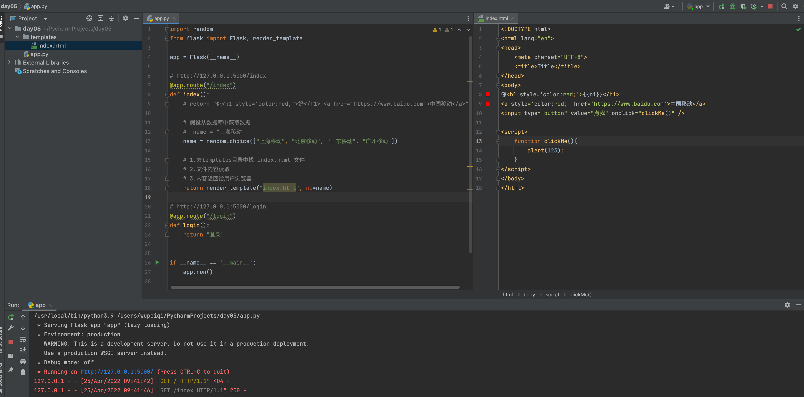
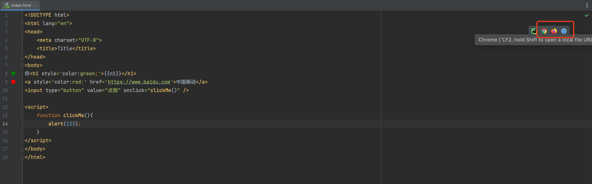
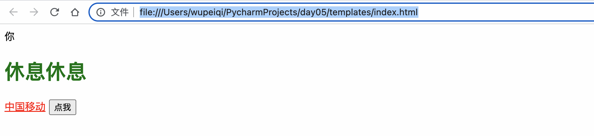
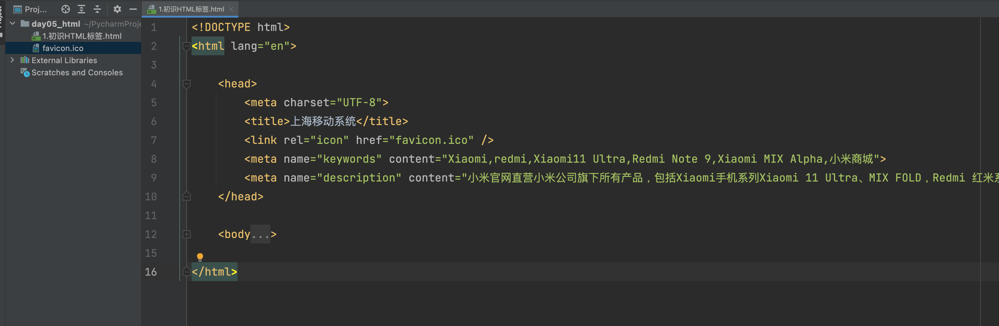
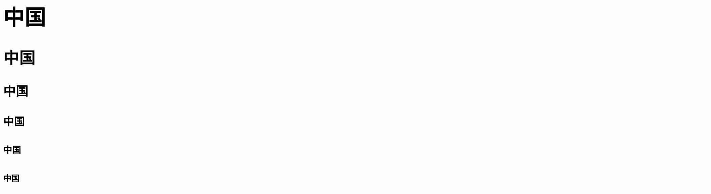
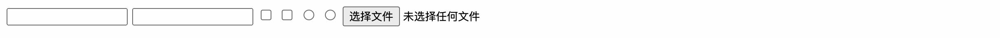
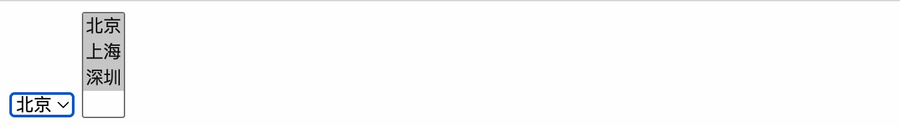
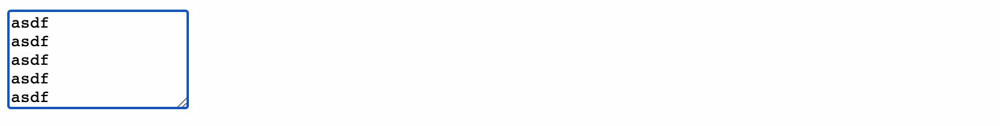
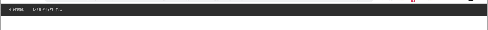

# day05 前端开发（上）

**基础阶段：**

- python入门
- 环境搭建
- 数据类型
- 函数
- 面向对象
- 模块

**中级：**

- 前端
- MySQL
- Django框架


## 1.初识网站

- flask，轻量级的框架 + 第三方模块。【暂时用】
- django，重武器，内部提供了很多方便的工具。【主讲】

```
pip install flask
```

```python
from flask import Flask

app = Flask(__name__)


# http://127.0.0.1:5000/index
@app.route("/index")
def index():
    return "你好"


# http://127.0.0.1:5000/login
@app.route("/login")
def login():
    return "登录"


if __name__ == '__main__':
    app.run()
```


## 2.前端部分

- HTML标签，裸体人

  ```
  a
  p
  div
  ```

- CSS样式，着装+打扮

- JavaScript页面动态效果，动态

- 模块+框架 的基础上来进行开发（推荐）。


## 3.HTML标签

HTML，超文本标记语言。


### 3.1 两种打开方式

- 通过网站去运行（项目最终）
  

- 平时开发（本地打开 + Pycharm）

  

- 其他方式（本地文件打开）
  


### 3.2 标签 Head

```html
<!DOCTYPE html>
<html lang="en">

    <head>
        <meta charset="UTF-8">
        <title>上海移动系统</title>
        <link rel="icon" href="favicon.ico" />
        <meta name="keywords" content="Xiaomi,redmi,Xiaomi11 Ultra,Redmi Note 9,Xiaomi MIX Alpha,小米商城">
        <meta name="description" content="小米官网直营小米公司旗下所有产品，包括Xiaomi手机系列Xiaomi 11 Ultra、MIX FOLD，Redmi 红米系列Redmi Note 9、Redmi K40 Pro，小米电视、笔记本、米家智能家居等，同时提供小米客户服务及售后支持.">
    </head>

    <body>

    </body>

</html>
```




### 3.2 body标签分类

- 块级标签：“霸道”，一个人占一整行。

  ```
  h1,div,ul,li,table
  ```

- 行内标签：“温顺”, 自己有多大有占多大。

  ```
  a,span,img,
  ```

  

### 3.3 div和span标签

没有任何的 `自带的特效`，非常素。

后期学习css样式后 + div素的标签，构造很多其他的效果。


### 3.4 h系列

`h1 ~ h6`标签，标题。




### 3.5 a标签

超链接，网站点击跳转。

```
<a>内容</a>
```

```
<a href="http://www.10086.cn/index/sh/index_210_210.html"   >上海移动</a>
```

```
<a href="http://www.10086.cn/index/sh/index_210_210.html" target="_blank">上海移动</a>
```


做锚点：

```html
<!DOCTYPE html>
<html lang="en">
<head>
    <meta charset="UTF-8">
    <title>Title</title>
</head>
<body>
<h1>目录</h1>
<a href="#n1">第1节：xxxx故事</a>
<a href="#n2">第2节：xxxx故事</a>
<a href="#xx">第3节：xxxx故事</a>
<a href="#content">第4节：xxxx故事</a>

<div id="n1" style="background-color: bisque;height: 1000px">第1节：xxxasdfa;sdkfa;skdjf;aksjd;fkajsdfa ;lskdjf;</div>
<div id="n2" style="background-color: olivedrab;height: 1000px">第2节：xxxasdfa;sdkfa;skdjf;aksjd;fkajsdfa ;lskdjf;</div>
<div id="xx" style="background-color: brown;height: 1000px">第3节：xxxasdfa;sdkfa;skdjf;aksjd;fkajsdfa ;lskdjf;</div>
<div id="content" style="background-color: pink;height: 1000px">第4节：xxxasdfa;sdkfa;skdjf;aksjd;fkajsdfa ;lskdjf;</div>

</body>
</html>
```


### 3.6 img标签

显示图片。

```

```

```

关于网络地址，能无法展示（网站加入防盗链）。


关于本地地址，路径问题。
```

```


```


### 3.7 表格标签

```html
<table border="1">
    <thead>
        <tr> <th>ID</th> <th>姓名</th>  <th>年龄</th> </tr>
        <tr> <th>ID</th> <th>姓名</th>  <th>年龄</th> </tr>
    </thead>

    <tbody>
        <tr> <td>1</td> <td>武沛齐</td> <td>88</td> </tr>
        <tr> <td>2</td> <td>武沛齐</td> <td>88</td> </tr>
        <tr> <td>3</td> <td>武沛齐</td> <td>88</td> </tr>
        <tr> <td>4</td> <td>武沛齐</td> <td>88</td> </tr>
    </tbody>
</table>
```


合并单元格。

```html
<!DOCTYPE html>
<html lang="en">
<head>
    <meta charset="UTF-8">
    <title>Title</title>
</head>
<body>

<table border="1">
    <thead>
        <tr>
            <th colspan="3">人员信息表</th>
        </tr>
        <tr>
            <th>ID</th>
            <th>姓名</th>
            <th>年龄</th>
        </tr>
    </thead>

    <tbody>
        <tr>
            <td>1</td>
            <td>武沛齐</td>
            <td rowspan="2">88</td>
        </tr>
        <tr>
            <td>2</td>
            <td>武沛齐</td>
        </tr>
    </tbody>
</table>

</body>
</html>
```


### 3.8 列表

```html
<ul>
    <li>北京</li>
    <li>上海</li>
    <li>深圳</li>
</ul>
```

```html
<ol>
    <li>xxx</li>
    <li>xxx</li>
    <li>xxx</li>
</ol>
```


### 小结

标签之前可以进行嵌套，来完成我们所需的功能。

```html
<!DOCTYPE html>
<html lang="en">
<head>
    <meta charset="UTF-8">
    <title>Title</title>
</head>
<body>

<a href="https://www.mi.com/redmik50">
    
</a>
<a href="https://www.mi.com/redmik50">
    
</a>
<a href="https://www.mi.com/redmik50">
    
</a>

</body>
</html>
```

```html
<!DOCTYPE html>
<html lang="en">
<head>
    <meta charset="UTF-8">
    <title>Title</title>
</head>
<body>

<div>
    <a href="https://www.mi.com/redmik50">
        
    </a>
    <a href="https://www.mi.com/redmik50">
        
    </a>
</div>

<div>
    <a href="https://www.mi.com/redmik50">
        
    </a>
</div>

</body>
</html>
```

以上的都是用来做数据展示，不包含交互的功能（输入内容）。


### 3.9 input系列



```
<!DOCTYPE html>
<html lang="en">
<head>
    <meta charset="UTF-8">
    <title>Title</title>
</head>
<body>
    <input type="text" />
    <input type="password" />
    <input type="checkbox" >
    <input type="checkbox" >
    <input type="radio" name="gd" >
    <input type="radio" name="gd" >
    <input type="file" >
</body>
</html>
```

### 3.10 下拉框



```
<!DOCTYPE html>
<html lang="en">
<head>
    <meta charset="UTF-8">
    <title>Title</title>
</head>
<body>
<select>
    <option>北京</option>
    <option>上海</option>
    <option>深圳</option>
</select>
<select multiple>
    <option>北京</option>
    <option>上海</option>
    <option>深圳</option>
</select>
</body>
</html>
```

### 3.11 textarea



```
<!DOCTYPE html>
<html lang="en">
<head>
    <meta charset="UTF-8">
    <title>Title</title>
</head>
<body>
    <textarea rows="5"></textarea>
</body>
</html>
```


注意：对于用于用户交互的标签来说，如果想要将数据提交到某个地方，需要将这些 全都包括在 form 标签中。

```html
<!DOCTYPE html>
<html lang="en">
<head>
    <meta charset="UTF-8">
    <title>Title</title>
</head>
<body>
     
    
    <form action="http://www.10086.cn/" method="get">
        <input type="text" name="v1">
        <input type="password" name="v2">

        <input type="submit" value="提交">
    </form>
</body>
</html>
```

想要提交数据必须具备三要素：

- form标签需要将用户交互的标签包裹。
- 需要 type="submit" 按钮，来触发提交表单的动作。
- 内部用户交互的标签必须有name属性； form标签必须有：action，提交地址；   method，提交方式（get/post)。


### 案例：丑陋版小米商城


```html
<!DOCTYPE html>
<html lang="en">
<head>
    <meta charset="UTF-8">
    <title>Title</title>
</head>
<body>

<div>
    <a href="https://www.mi.com/index.html">小米商城</a>
    <a href="https://home.miui.com/" target="_blank">MIUI</a>
    <a href="https://airstar.com/home" target="_blank">天星熟客</a>
    <a href="https://qiye.mi.com/" target="_blank">企业团购</a>
</div>
<div>
    <form action="https://www.mi.com/search" method="get">
        <a href="https://www.mi.com/index.html">
            
        </a>

        <a href="https://www.mi.com/index.html">小米手机</a>
        <a href="https://www.mi.com/index.html">红米手机</a>
        <a href="https://www.mi.com/index.html">电视</a>

        <input type="text" placeholder="请输入关键字" name="keyword"/>
        <input type="submit" value="搜索">
    </form>
</div>

</body>
</html>
```


### 案例：丑陋的小米商城（网站）

关于图片：

- 本地方式打开，图片可以放在任意目录，html中引入时，根据相对路径引入。
- Flask网站打开
  - 文件存储位置，必须在 static 目录。
  - 在HTML中引入时，必须 /static/..... 


### 案例：xx管理平台

- 注册

  ```
  用户输入基本信息，信息存储文件中。
  ```

- 用户列表

  ```
  读取文件，并在页面上展示所有的账户信息。
  ```


## 4.CSS样式

CSS（Cascading Style Sheets）称为层叠样式表，用于对页面进行美化。

本质上就是对标签进行点缀。


### 4.1 初识CSS样式

```html
<div>男同学赵伟</div>
```

```html
<div style="color:red; font-size:18px; background-color:pink;">男同学赵伟</div>
```

```html
<!DOCTYPE html>
<html lang="en">
<head>
    <meta charset="UTF-8">
    <title>Title</title>
    
    <style>
        .xx{
            color:red; 
            font-size:18px; 
            background-color:pink;
        }
    </style>
</head>
<body>
	<div class="xx">男同学赵伟</div>
	<div class="xx">男同学赵伟</div>
	<div class="xx">男同学赵伟</div>
</body>
</html>
```


CSS样式的选择器：

- 标签选择器

  ```html
  <!DOCTYPE html>
  <html lang="en">
  <head>
      <meta charset="UTF-8">
      <title>Title</title>
      
      <style>
          div{
              color:red; 
              font-size:18px; 
              background-color:pink;
          }
      </style>
  </head>
  <body>
  	<div>男同学赵伟</div>
  	<div>男同学赵伟</div>
  	<div>男同学赵伟</div>
      <a>男同学赵伟</a>
      
  </body>
  </html>
  ```

- ID选择器

  ```html
  <!DOCTYPE html>
  <html lang="en">
  <head>
      <meta charset="UTF-8">
      <title>Title</title>
      
      <style>
          #n1{
              color:red; 
              font-size:18px; 
              background-color:pink;
          }
      </style>
  </head>
  <body>
  	<div id="n1">男同学赵伟</div>
  	<div>男同学赵伟</div>
  	<div>男同学赵伟</div>
      <a>男同学赵伟</a>
  </body>
  </html>
  ```

- 后代相关

  ```html
  <!DOCTYPE html>
  <html lang="en">
  <head>
      <meta charset="UTF-8">
      <title>Title</title>
      
      <style>
          .header a{
              color:red; 
              font-size:18px; 
              background-color:pink;
          }
          .footer > a{
              color:red; 
              font-size:18px; 
              background-color:pink;
          }
      </style>
  </head>
  <body>
  	<div class='header'>
          <ul>
              <li>武沛齐</li>
              <li>张弛</li>
              <li>
                  <a href='https://www.baidu.com'>百度</a>
              </li>
          </ul>
      </div>
      
      <div class='footer'>
          <a href='https://www.baidu.com'>百度</a>
          <div>
  	        <a href='https://www.baidu.com'>百度</a>
          </div>
      </div>
  </body>
  </html>
  ```

- 分组

  ```html
  <!DOCTYPE html>
  <html lang="en">
  <head>
      <meta charset="UTF-8">
      <title>Title</title>
      
      <style>
          div,a,span,h1{
              color:red;
          }
          .c1{
              display:block;
          }
      </style>
  </head>
  <body>
      <div>xx</div>
      <a class='c1'>xx</a>
      <span>xxx</span>
      <h1>xxx</h1>
  </body>
  </html>
  ```

- 属性选择器

  ```html
  <!DOCTYPE html>
  <html lang="en">
  <head>
      <meta charset="UTF-8">
      <title>Title</title>
      
      <style>
          input[type='text']{
           	color:red;   
          }
      </style>
  </head>
  <body>
      <input type='text' />
      <input type='password' />
  </body>
  </html>
  ```


扩展：如果多个页面都会用到相同的样式，你可以将样式写到单独的css文件，页面想要使用的就直接去导入即可。

static/v1.css

```
.xx{
	color:red;
}
```


demo1.html

```html
<!DOCTYPE html>
<html lang="en">
<head>
    <meta charset="UTF-8">
    <title>Title</title>
    <link rel="stylesheet" href="/static/v1.css">
</head>
<body>
<h1 class='xx'>用户注册</h1>

</body>
</html>
```


demo2.html

```html
<!DOCTYPE html>
<html lang="en">
<head>
    <meta charset="UTF-8">
    <title>Title</title>
    <link rel="stylesheet" href="/static/v1.css">
</head>
<body>
<h1 class='xx'>用户登录</h1>

</body>
</html>
```


总结：

- 在页面中引用CSS样式，有是那种方式：
  - 标签
  - 页面head头部 【选择器】
  - 参数css文件    【选择器】


### 4.2 高度和宽度

> 默认情况下，高度和宽度无法应用在行内标签上。
>
> 默认情况下，块级标签虽然设置的宽度，右边空白区域也不需被占用，霸道。

```html
<!DOCTYPE html>
<html lang="en">
<head>
    <meta charset="UTF-8">
    <title>Title</title>
</head>
<body>
<div style="height: 100px;width: 200px;background-color: red;">上海移动</div>
<div style="height: 100px;width: 200px;background-color: gold;">中国联通</div>


<span style="height: 100px;width: 200px;background-color: red;">上海移动</span>
<span style="display:block; height: 100px;width: 200px;background-color: red;">上海移动</span>


</body>
</html>
```


### 4.3 行内和块级标签

- 块级
- 行内，无法应用高度和宽度
- 块级&行内，

```html
<!DOCTYPE html>
<html lang="en">
<head>
    <meta charset="UTF-8">
    <title>Title</title>
</head>
<body>
    <div style="display: inline;">信息</div>
    <span style="display: block;">谢新雪</span>
    <div style="display: inline-block; height: 100px;background-color: red;">学习宪法</div>
</body>
</html>
```


### 4.4 文本对齐方式

- 水平方向：`<h1 style="text-align: center">前端开发</h1>`

- 垂直方向：

  ```
  <h1 style="text-align: center;width:500px;height: 200px;background-color: olive;line-height: 200px;">前端开发</h1>
  ```

  


### 4.5 案例：顶部菜单



```html
<!DOCTYPE html>
<html lang="en">
<head>
    <meta charset="UTF-8">
    <title>Title</title>
    <style>
        body {
            margin: 0;
        }

        .header {
            height: 40px;
            font-size: 12px;
            color: #b0b0b0;
            background: #333;

            line-height: 40px;
        }
        .header a{
            display: inline-block;
            text-align: center;


            color: #b0b0b0;
            text-decoration: none;
        }
    </style>
</head>
<body>

<div class="header">
    <a href="https://www.mi.com/" style="width: 100px;">小米商城</a>
    <a href="https://www.mi.com/">MIUI</a>
    <a href="https://www.mi.com/">云服务</a>
    <a href="https://www.mi.com/">御品</a>

</div>


</body>
</html>
```


### 4.6 外边距

理我远一点。

```
margin-top:10px;
margin-left:10px;

margin:10px;     /* 上下左右 */

margin:10px 20px;   /* 上下=10   左右=20 */

margin:10px 20px 9px 4px;  /* 上 右 下 左  -> 顺时针*/ 
```


```html
<!DOCTYPE html>
<html lang="en">
<head>
    <meta charset="UTF-8">
    <title>Title</title>
    <style>
        body{
            margin: 0;
        }
    </style>
</head>
<body>
    <div style="background-color: red;height: 100px"></div>
    <div style="background-color: green;height: 100px;margin-top: 20px;"></div>
</body>
</html>
```


特殊的margin，左右边距自动 => 标签居中。

- 区域居中
  

  ```html
  <!DOCTYPE html>
  <html lang="en">
  <head>
      <meta charset="UTF-8">
      <title>Title</title>
      <style>
          .login-box {
              height: 300px;
              width: 500px;
              background-color: #b0b0b0;
  
              margin-left: auto;
              margin-right: auto;
              margin-top: 200px;
  
          }
      </style>
  </head>
  <body>
      <div class="login-box"></div>
  
  </body>
  </html>
  ```

- 常见布局会使用 
  

  ```html
  <!DOCTYPE html>
  <html lang="en">
  <head>
      <meta charset="UTF-8">
      <title>Title</title>
      <style>
          body {
              margin: 0;
          }
  
          .header {
              height: 40px;
              font-size: 12px;
              color: #b0b0b0;
              background: #333;
  
              line-height: 40px;
          }
  
          .header a {
              display: inline-block;
              color: #b0b0b0;
              text-decoration: none;
          }
  
          .container {
              width: 1226px;
  
              margin-right: auto;
              margin-left: auto;
          }
      </style>
  </head>
  <body>
  
  <div class="header">
      <div class="container">
          <a href="https://www.mi.com/">小米商城</a>
          <a href="https://www.mi.com/">MIUI</a>
          <a href="https://www.mi.com/">云服务</a>
          <a href="https://www.mi.com/">御品</a>
  
          <a href="https://www.mi.com/">御品</a>
      </div>
  </div>
  
  </body>
  </html>
  ```

  

  

  

  

### 4.7 内边距

内边距，再胖一点。

注意：自己变大。

```
padding-left: 10px

padding:10px;

padding:10px 20px;

padding:10px 20px 10px 20px;
```


```html
<!DOCTYPE html>
<html lang="en">
<head>
    <meta charset="UTF-8">
    <title>Title</title>

</head>
<body>
    <div style="background-color: red;height: 50px;"></div>
    <div style="width: 500px;height: 500px;background-color: gold;padding-top: 20px;padding-left: 20px;">
        <div>百度</div>
        <div>谷歌</div>
        <div>搜狗</div>
    </div>
</body>
</html>
```


### 4.8 案例：顶部菜单


```html
<!DOCTYPE html>
<html lang="en">
<head>
    <meta charset="UTF-8">
    <title>Title</title>
    <style>
        body {
            margin: 0;
        }

        .header {
            height: 40px;
            font-size: 12px;
            color: #b0b0b0;
            background: #333;

            line-height: 40px;
        }

        .header a {
            display: inline-block;
            color: #b0b0b0;
            text-decoration: none;
        }

        .container {
            width: 1226px;

            margin-right: auto;
            margin-left: auto;
        }
        .header .menu{
            padding: 0 10px;
        }
    </style>
</head>
<body>

<div class="header">
    <div class="container">
        <a href="https://www.mi.com/" style="margin-right: 20px;">小米商城</a>
        <a class="menu" href="https://www.mi.com/">MIUI</a>
        <a class="menu" href="https://www.mi.com/">云服务</a>
        <a class="menu" href="https://www.mi.com/">御品</a>
        <a class="menu" href="https://www.mi.com/">御品</a>
    </div>
</div>


</body>
</html>
```


**提醒**：行内标签设置 外边距 & 内边距 都是无效。


### 4.9 float

float可以让你的标签进行浮动展示。 `漂,脱离文档流。`

```
<div>
	<div style="float:left;">左边</div>
	<div style='float:rigth;'>右边</div>
</div>
```


```html
<!DOCTYPE html>
<html lang="en">
<head>
    <meta charset="UTF-8">
    <title>Title</title>
    <style>
        body {
            margin: 0;
        }

        .header {
            height: 40px;
            font-size: 12px;
            color: #b0b0b0;
            background: #333;

            line-height: 40px;
        }

        .header a {
            display: inline-block;
            color: #b0b0b0;
            text-decoration: none;
        }

        .container {
            width: 1226px;

            margin-right: auto;
            margin-left: auto;
        }
        .header .menu{
            padding: 0 10px;
        }
    </style>
</head>
<body>

<div class="header">
    <div class="container">
        <a href="https://www.mi.com/" style="margin-right: 20px;">小米商城</a>
        <a class="menu" href="https://www.mi.com/">MIUI</a>
        <a class="menu" href="https://www.mi.com/">云服务</a>
        <a class="menu" href="https://www.mi.com/">御品</a>
        <a class="menu" href="https://www.mi.com/">御品</a>

        <div style="float: right">
            <a class="menu" href="https://www.mi.com/">登录</a>
            <a class="menu" href="https://www.mi.com/">注册</a>

        </div>

    </div>
</div>


</body>
</html>
```


