# day06 前端开发（下）

- HTML标签：a、img、div、form、input、select

- CSS样式：高度、宽度、外边距、内边距、块和行内、文字对齐、float、....

  ```
  <h1 style='text-align:center;'>Python课程</h1>    文字居中
  
  <div style="width:300px;margin-left:auto;margin-right:auto;">x</div>   整体居中
  ```

- JavaScript语言：编程语言在浏览器执行。 【Python】

- jQuery，别人写好的模块（类库），我们编写功能时就会更加简单。【第三方模块】

- BootStrap，别人写好的模块（CSS、JavaScript）+ 样式。


## 1.CSS样式


### 1.1 float

页面布局必不可少的一个样式，让标签左右飘。


- 用于页面布局
  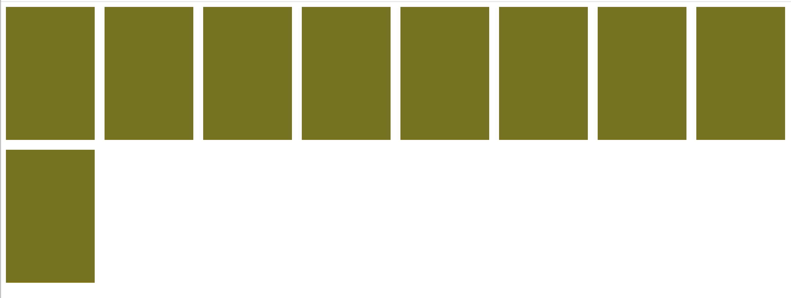

  ```html
  <!DOCTYPE html>
  <html lang="en">
  <head>
      <meta charset="UTF-8">
      <title>Title</title>
      <style>
          body{
              margin: 0;
          }
          .item{
              height: 270px;
              width: 180px;
              background-color: olive;
              margin: 10px;
              float: left;
          }
      </style>
  </head>
  <body>
      <div class="course">
          <div class="item"></div>
          <div class="item"></div>
          <div class="item"></div>
          <div class="item"></div>
          <div class="item"></div>
          <div class="item"></div>
          <div class="item"></div>
          <div class="item"></div>
          <div class="item"></div>
      </div>
  </body>
  </html>
  ```

- 左右飘
  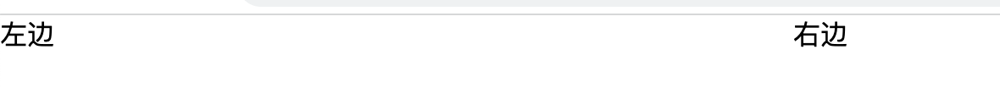

  ```html
  <!DOCTYPE html>
  <html lang="en">
  <head>
      <meta charset="UTF-8">
      <title>Title</title>
      <style>
          body{
              margin: 0;
          }
      </style>
  </head>
  <body>
      <div style="width: 500px;">
         <div style="float: left">左边</div>
         <div style="float: right">右边</div>
      </div>
  </body>
  </html>
  ```


没有飘：

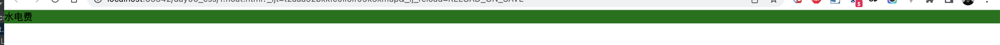

```
<div style="background-color: green">
    <div>水电费</div>
</div>
```


如果飘（笨方法）：

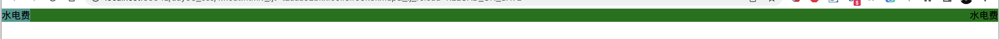

```
<div style="background-color: green">
    <div style="float: left;">水电费</div>
    <div style="float: right;">水电费</div>

    <div style="clear: both;"></div>
</div>
```


如果飘（聪明方法）：

- 先了解after
  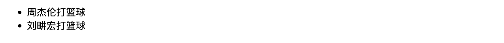

  ```html
  <!DOCTYPE html>
  <html lang="en">
  <head>
      <meta charset="UTF-8">
      <title>Title</title>
      <style>
          li:after{
              content: "打篮球";
          }
      </style>
  </head>
  <body>
  <ul>
      <li>周杰伦</li>
      <li>刘畊宏</li>
  </ul>
  
  </body>
  </html>
  ```

- 编写clearfix

  ```html
  <!DOCTYPE html>
  <html lang="en">
  <head>
      <meta charset="UTF-8">
      <title>Title</title>
      <style>
          body{
              margin: 0;
          }
          .bg,.xxx,.hhhh{
              background-color: green
          }
          .clearfix:after{
              display: block;
              content: '';
              clear: both;
          }
      </style>
  </head>
  <body>
      <div class="bg clearfix" >
          <div style="float: left;">水电费</div>
          <div style="float: right;">水电费</div>
      </div>
  
      <div class="xxx clearfix" >
          <div style="float: left;">水电费</div>
          <div style="float: right;">水电费</div>
      </div>
  
      <div class="hhhh clearfix" >
          <div style="float: left;">水电费</div>
          <div style="float: right;">水电费</div>
      </div>
  </body>
  </html>
  ```

  


### 1.2 hover

```html
<!DOCTYPE html>
<html lang="en">
<head>
    <meta charset="UTF-8">
    <title>Title</title>
    <style>
        .c1{
            color: red;
        }
        .c1:hover{
            color: green;
        }
    </style>
</head>
<body>
    <div class="c1">中国移动</div>
</body>
</html>
```


### 1.3 案例：小米头部

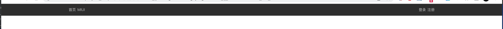

```
<!DOCTYPE html>
<html lang="en">
<head>
    <meta charset="UTF-8">
    <title>Title</title>
    <style>
        body {
            margin: 0;
        }

        .top {
            background-color: #333;
        }

        .container {
            width: 1228px;
            margin: 0 auto;
        }

        .clearfix:after {
            display: block;
            content: '';
            clear: both;
        }

        .top a{
            display: inline-block;
            line-height: 40px;
            color: #b0b0b0;
            font-size: 12px;
            text-decoration: none;
        }
        .top a:hover{
            color: white;
        }
    </style>
</head>
<body>

<div class="top">
    <div class="container clearfix">
        <a href="https://www.mi.com/">首页</a>
        <a href="https://www.mi.com/">MIUI</a>
        <div style="float: right">
            <a href="https://www.mi.com/">登录</a>
            <a href="https://www.mi.com/">注册</a>
        </div>
    </div>
</div>

</body>
</html>
```


### 1.4 案例：Logo菜单

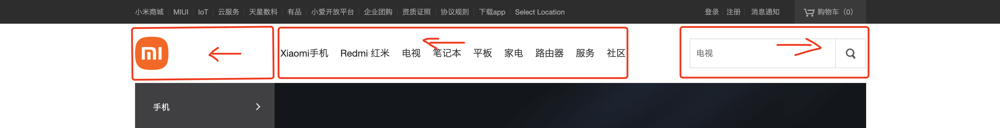


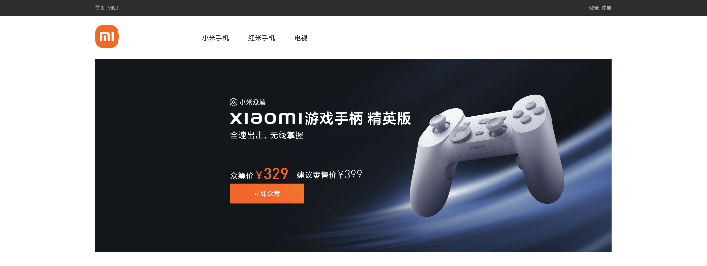

```html
<!DOCTYPE html>
<html lang="en">
<head>
    <meta charset="UTF-8">
    <title>Title</title>
    <style>
        body {
            margin: 0;
        }

        .top {
            background-color: #333;
        }

        .container {
            width: 1226px;
            margin: 0 auto;
        }

        .clearfix:after {
            display: block;
            content: '';
            clear: both;
        }

        .top a {
            display: inline-block;
            line-height: 40px;
            color: #b0b0b0;
            font-size: 12px;
            text-decoration: none;
        }

        .top a:hover {
            color: white;
        }

        .hd .logo {
            float: left;
            width: 234px;
        }

        .hd .main-menu {
            float: left;
        }
        .hd .main-menu a{
            display: inline-block;
            padding: 40px 20px;
            color: #333;
            text-decoration: none;
        }
        .hd .main-menu a:hover{
            color: #ff6700;
        }
        .hd .search {
            float: right;
        }
    </style>
</head>
<body>

<div class="top">
    <div class="container clearfix">
        <a href="https://www.mi.com/">首页</a>
        <a href="https://www.mi.com/">MIUI</a>
        <div style="float: right">
            <a href="https://www.mi.com/">登录</a>
            <a href="https://www.mi.com/">注册</a>
        </div>
    </div>
</div>

<div class="hd">
    <div class="container clearfix">
        <div class="logo">
            <a style="height: 56px;width: 56px;display: inline-block;margin-top: 20px;">
                
            </a>

        </div>
        <div class="main-menu">
            <a href="https://www.mi.com/">小米手机</a>
            <a href="https://www.mi.com/">红米手机</a>
            <a href="https://www.mi.com/">电视</a>
        </div>
        <div class="search">
        </div>
    </div>
</div>

<div class="banner">
    <div class="container">
        <a style="width: 1226px">
            
        </a>
    </div>
</div>


</body>
</html>
```


### 1.5 边框

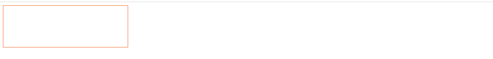

```html
<!DOCTYPE html>
<html lang="en">
<head>
    <meta charset="UTF-8">
    <title>Title</title>
    <style>
        .c1{
            height: 100px;
            width: 300px;
             border: 1px solid #ff6700;
            /*border-right: 1px solid #ff6700;*/
            /*border-bottom: 1px solid #ff6700;*/
        }
    </style>
</head>
<body>
    <div class="c1"></div>
</body>
</html>
```


- 场景：菜单激活状态

  ```html
  <!DOCTYPE html>
  <html lang="en">
  <head>
      <meta charset="UTF-8">
      <title>Title</title>
      <style>
          .menu {
              display: inline-block;
              padding: 10px;
              margin-right: 20px;
  
              border-bottom: 2px solid transparent;
          }
  
          .menu:hover {
              border-bottom: 2px solid red;
          }
      </style>
  </head>
  <body>
  <div>adf</div>
  <div>
      <a class="menu">菜单1</a>
      <a class="menu">菜单2</a>
  </div>
  <div>adf</div>
  </body>
  </html>
  ```

- 场景
  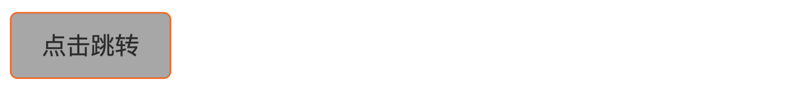

  ```html
  <!DOCTYPE html>
  <html lang="en">
  <head>
      <meta charset="UTF-8">
      <title>Title</title>
      <style>
          .btn{
              display: inline-block;
              padding: 10px 20px;
              color: #333333;
              text-decoration: none;
              background-color: #b0b0b0;
              border: 1px solid #ff6700;
              border-radius: 5px;
          }
      </style>
  </head>
  <body>
      <a class="btn" href="http://www.baidu.com">点击跳转</a>
  
  </body>
  </html>
  ```

### 1.6 position

- fiexed，永远固定在窗口的指定位置。

  ```html
  <!DOCTYPE html>
  <html lang="en">
  <head>
      <meta charset="UTF-8">
      <title>Title</title>
  </head>
  <body>
      <div style="height: 5000px;background-color: #b0b0b0">asdf</div>
  
      <div style="position: fixed;left: 10px;bottom:10px">返回顶部</div>
  </body>
  </html>
  ```

  

  ```html
  <!DOCTYPE html>
  <html lang="en">
  <head>
      <meta charset="UTF-8">
      <title>Title</title>
      <style>
          .login-box{
              border: 1px solid red;
              height: 300px;
              width: 500px;
              margin: 0 auto;
  
              position: fixed;
              top: 200px;
              left: 0;
              right: 0;
          }
      </style>
  </head>
  <body>
      <div style="height: 5000px;background-color: #b0b0b0">asdf</div>
  
      <div class="login-box">
          asdf
      </div>
  </body>
  </html>
  ```


  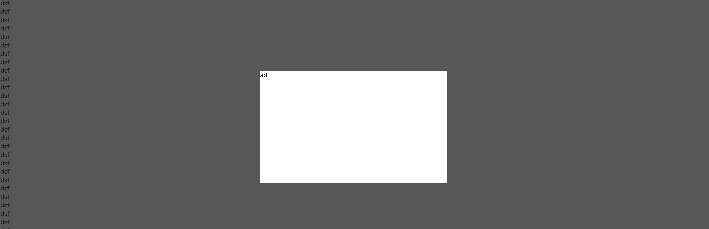

  ```
  <!DOCTYPE html>
  <html lang="en">
  <head>
      <meta charset="UTF-8">
      <title>Title</title>
      <style>
          .middle{
              position: fixed;
              background-color: #333333;
              left: 0;
              right: 0;
              top: 0;
              bottom: 0;
              opacity: 0.8;
              z-index: 1000;
          }
          .outer{
              position: fixed;
              background-color: white;
              height: 300px;
              width: 500px;
              left: 0;
              right: 0;
              margin: 0 auto;
              top:200px;
              z-index: 1001;
          }
      </style>
  </head>
  <body>
      <div style="height: 5000px;">
          <div>adsf</div>
          <div>adsf</div>
          <div>adsf</div>
          
      </div>
  
  
      <div class="outer">adf</div>
      <div class="middle"></div>
  
  
  </body>
  </html>
  ```

- absolute & relative
  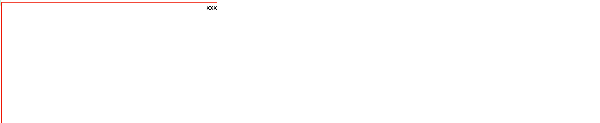

  ```html
  <!DOCTYPE html>
  <html lang="en">
  <head>
      <meta charset="UTF-8">
      <title>Title</title>
  </head>
  <body>
      <div style="height: 500px;width: 500px;border: 1px solid red;position: relative">
          <div style="position: absolute;right: 0;top: 0;">xxx</div>
      </div>
  </body>
  </html>
  ```

  

**强调**：写 & 懂 （ 框架基础改）。


## 2.JavaScript相关

JavaScript，后面简称JS。

- JavaScript，是一门编程语言，代码交给浏览器去运行。【Python】

- DOM，js代码去操作HTML标签。【内置模块】

  ```
  document.getElementById("content")
  ```

- BOM，浏览器内置的功能。【内置模块】

  ```
  alert
  ```

```html
<!DOCTYPE html>
<html lang="en">
<head>
    <meta charset="UTF-8">
    <title>Title</title>
</head>
<body>
    <input type="text" placeholder="请输入内容" id="content" />
    <input type="button" value="点击" onclick="clickMe();" />
    <h1>显示内容</h1>
    <div id="txt">无</div>

    <script>
        function clickMe(){
            // 1.获取用户输入的内容
            var tag = document.getElementById("content");
            var userInputData = tag.value;

            // 2.找到div，并将内容赋值
            var tagTxt = document.getElementById("txt");
            tagTxt.innerText = userInputData;
        }
    </script>
</body>
</html>
```


### 2.1 存放位置

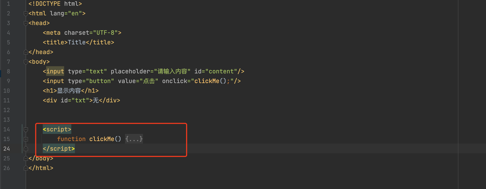


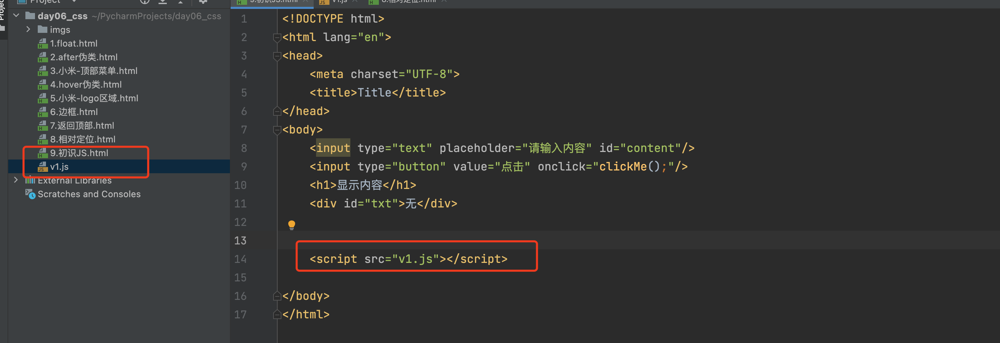


### 2.2 关于注释

- HTML

  ```
  <!-- <h1>显示内容</h1> -->
  ```

- CSS

  ```css
  <style>
      .c1{
          /* color:red; */
          background-color: red;
      }
  </style>
  ```

- JavaScript

  ```html
  <script>
      
  // 1.获取用户输入的内容
  /*  多行注释。。asdfasdf阿斯蒂芬 */
      
  </script>
  ```

  

### 2.3 变量

```
user_name = "武沛齐"

var userName = "武沛齐";
```

- 全局变量，代码块顶格。
- 局部变量，函数中变量。

```html
<!DOCTYPE html>
<html lang="en">
<head>
    <meta charset="UTF-8">
    <title>Title</title>
</head>
<body>
<script>
    // 全部变量
    NAME = "武沛齐";

    function xxxx() {
        // 局部变量
        var age = 19;
        alert(age);
        alert(NAME);
    }
    alert(NAME);
    
</script>
</body>
</html>
```

### 2.4 数据类型

```javascript
var age = 19;

var name = "武沛齐";

var data = true;

var dataList = [11,22,33];

var info = {name:"武沛齐",age:19}
var info = {"name":"武沛齐","age":19}
```


### 2.5 语句

```javascript
var age = 19;
if (age < 18){
    ...
}else{
    ...
}
```

```javascript
var age = 19;
if (age < 18){
    ...
}else if(age==19){
    ...
}else{
    ...
}
```


```javascript
var dataList = [11,22,33,44];

for(var i=0; i < dataList.lenght ; i++){
    console.log(i);  // print
}

for(var idx in dataList){
    var data = dataList[idx]
    console.log(idx, data);
}
```


### 2.6 函数

```javascript
function func(a1,a2){
    var a3 = a1 + a2;
    return a3;
}

var res = func(11,22);
console.log(res); // 33
```


**匿名函数**，没名字。

```javascript
setInterval(函数, 1000);
```

```javascript
function func(){
    console.log(123123);
}

setInterval(func, 1000);
```

```javascript
setInterval(function(){
    console.log(123123);
}, 1000);
```


**自执行函数**，自动执行（闭包）。

```javascript
function func(a1,a2){
    console.log(a1,a2);
}
func("xxxxx","123");
```

```javascript
(function(a1,a2){
    console.log(a1,a2);
})("xxxxx","123")
```


### 2.7 序列化

- JSON.stringify(对象)， js中的对象转换成 JSON字符串

  ```javascript
  var info = {name:"武沛齐",age:19}
  var infoStr = JSON.stringify(info);
  console.log(infoStr);  // '{"name":"武沛齐","age":19}'
  ```

- JSON.parse(字符串)，JSON字符串转换成js对象

  ```javascript
  var dataString = '{"name":"武沛齐","age":19}';
  var info = JSON.parse(dataString);
  console.log(info);     // {name: '武沛齐', age: 19}
  ```


**提示**：ES5  /  现阶段ES6（很多前后端分离项目）+ ES6编译转换ES5。


## 3.DOM和BOM

- DOM，对页面上的HTML标签进行操作。

  ```
  var tag = document.getElementById("content");
  ...
  ```

- BOM，对浏览器进行操作

  ```
  alert
  confirm
  setInterval
  ```

注意：用着两个模块可以实现页面的所有效果，但是比较费劲。


### 案例：菜单切换

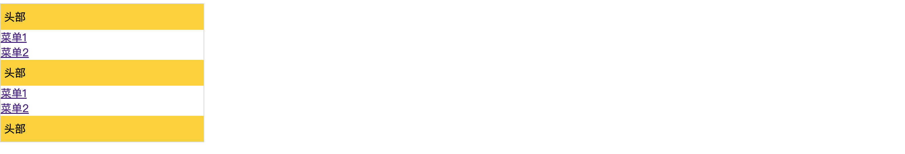

```html
<!DOCTYPE html>
<html lang="en">
<head>
    <meta charset="UTF-8">
    <title>Title</title>
    <style>
        .group {
            width: 300px;
            border: 1px solid #ddd;
        }

        .group .header {
            background-color: gold;
            padding: 8px 5px;
        }

        .group .menu a {
            display: block;
        }

        .hide {
            display: none;
        }
    </style>
</head>
<body>
<div class="group">
    <div class="item">
        <div class="header" onclick="clickMenu(this);">头部</div>
        <div class="menu">
            <a href="https://www.baidu.com">菜单1</a>
            <a href="https://www.baidu.com">菜单2</a>
        </div>

    </div>
    <div class="item">
        <div class="header" onclick="clickMenu(this);">头部</div>
        <div class="menu">
            <a href="https://www.baidu.com">菜单1</a>
            <a href="https://www.baidu.com">菜单2</a>
        </div>

    </div>
    <div class="item">
        <div class="header" onclick="clickMenu(this);">头部</div>
        <div class="menu">
            <a href="https://www.baidu.com">菜单1</a>
            <a href="https://www.baidu.com">菜单2</a>
        </div>

    </div>
</div>

<script>
    function clickMenu(ths) {
        // ths，代指的当前点击的那个标签
        // 1.找到自己下面的一个兄弟标签
        // 2.给他加上一个样式 hide
        var tag = ths.nextElementSibling;
        if (tag.className == "menu") {
            tag.classList.add("hide")
        } else {
            tag.classList.remove("hide")
        }
    }
</script>

</body>
</html>
```


## 4.jQuery

是一个别人封装好了模块（类库），代码量更少的实现我们想要的功能。

- 下载jQuery
- 代码引入
- 根据jQuery的用法来进行操作即可。

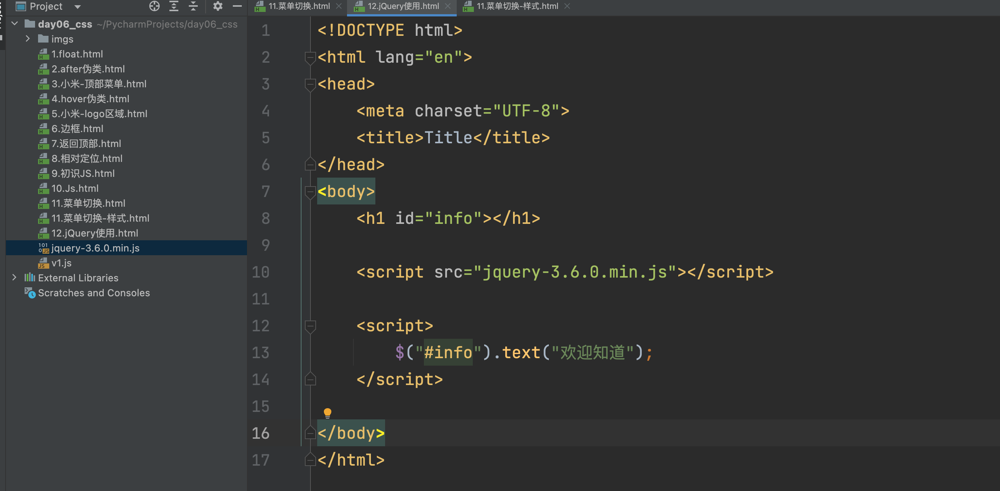


### 4.1 选择器

寻找想要的标签。

- ID选择器

  ```html
  <h1 id="info"></h1>
  <h1 id="info2"></h1>
  <h1 id="info3"></h1>
  
  
  <script src="jquery-3.6.0.min.js"></script>
  <script>
      $("#info")
  </script>
  ```

- class选择器

  ```html
  <h1 class="info"></h1>
  <h1 class="info"></h1>
  <h1 class="info3">ffff</h1>
  
  
  <script src="jquery-3.6.0.min.js"></script>
  <script>
      $(".info").text("xxx");
  </script>
  ```

- 标签选择器

  ```html
  <h1 class="info"></h1>
  <h2 class="info"></h1>
  <h3 class="info3">ffff</h1>
  
  
  <script src="jquery-3.6.0.min.js"></script>
  <script>
      $("h1").text("xxx");
  </script>
  ```

- 多选择器

  ```html
  <h1 class="info"></h1>
  <h2 class="info"></h1>
  <h3 class="info3">ffff</h1>
  <div id='v1'>
      sdf
  </div>
  
  
  <script src="jquery-3.6.0.min.js"></script>
  <script>
      $("h1,.info3,#v1").text("xxx");
  </script>
  ```

- 层级选择器

  ```html
  <div id='v1'>
      <h1>
          sdfsd
      </h1>
      <ul>
          <li>x1</li>
          <li>x2</li>
      </ul>
  </div>
  
  
  <script src="jquery-3.6.0.min.js"></script>
  <script>
      $("#v1 li").text("xxx");
  </script>
  ```

  

### 4.2 筛选器

```html
<div id='v1'>
    <h1>
        sdfsd
    </h1>
    <ul id='menus'>
        <li>x1</li>
        <li id='xx'>x1</li>
        <li>x2</li>
        <li>x2</li>
    </ul>
</div>

// 父级
$("#xx").parent()
$("#xx").parent().parent()

// 孩子
$("#menus").children()

// 兄弟
$("#xx").next()
$("#xx").prev()
$("#xx").siblings()

// 子孙中寻找
$("#v1").find("li")
$("#v1").find("#xx")
$("#v1").find(".hh")
```


### 4.3 样式操作

```javascript
$("#v1").addClass("样式名称");
$("#v1").removeClass("样式名称");
$("#v1").hasClass("样式名称");
$("#v1").toggleClass("样式名称");
```

补充：jQery支持链式编程。`$("#v1").addClass("xxx").text("xxxx").xxx().xxx()....`

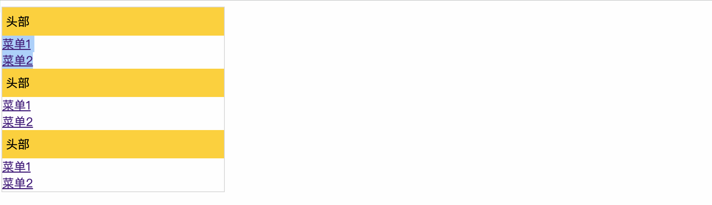


```html
<!DOCTYPE html>
<html lang="en">
<head>
    <meta charset="UTF-8">
    <title>Title</title>
    <style>
        .group {
            width: 300px;
            border: 1px solid #ddd;
        }

        .group .header {
            background-color: gold;
            padding: 8px 5px;
        }

        .group .menu a {
            display: block;
        }

        .hide {
            display: none;
        }
    </style>
</head>
<body>
<div class="group">
    <div class="item">
        <div class="header">头部</div>
        <div class="menu">
            <a href="https://www.baidu.com">菜单1</a>
            <a href="https://www.baidu.com">菜单2</a>
        </div>

    </div>
    <div class="item">
        <div class="header">头部</div>
        <div class="menu">
            <a href="https://www.baidu.com">菜单1</a>
            <a href="https://www.baidu.com">菜单2</a>
        </div>

    </div>
    <div class="item">
        <div class="header">头部</div>
        <div class="menu">
            <a href="https://www.baidu.com">菜单1</a>
            <a href="https://www.baidu.com">菜单2</a>
        </div>

    </div>
</div>

<script src="jquery-3.6.0.min.js"></script>
<script>
    // 给所有 clss=header 的标签设置点击事件
    $(".header").click(function () {
        // $(this)
        /*
        if ($(this).next().hasClass("hide")) {
            $(this).next().removeClass('hide');
        } else {
            $(this).next().addClass('hide');
        }
         */
        $(this).next().toggleClass('hide');

    });

</script>
</body>
</html>
```

```html
<!DOCTYPE html>
<html lang="en">
<head>
    <meta charset="UTF-8">
    <title>Title</title>
    <style>
        .group {
            width: 300px;
            border: 1px solid #ddd;
        }

        .group .header {
            background-color: gold;
            padding: 8px 5px;
        }

        .group .menu a {
            display: block;
        }

        .hide {
            display: none;
        }
    </style>
</head>
<body>
<div class="group">
    <div class="item">
        <div class="header">头部</div>
        <div class="menu hide">
            <a href="https://www.baidu.com">菜单1</a>
            <a href="https://www.baidu.com">菜单2</a>
        </div>

    </div>
    <div class="item">
        <div class="header">头部</div>
        <div class="menu hide ">
            <a href="https://www.baidu.com">菜单1</a>
            <a href="https://www.baidu.com">菜单2</a>
        </div>

    </div>
    <div class="item">
        <div class="header">头部</div>
        <div class="menu hide">
            <a href="https://www.baidu.com">菜单1</a>
            <a href="https://www.baidu.com">菜单2</a>
        </div>

    </div>
</div>

<script src="jquery-3.6.0.min.js"></script>
<script>
    // 给所有 clss=header 的标签设置点击事件
    $(".header").click(function () {
        // 自己展开
         $(this).next().removeClass('hide');

        // 别人，给他关闭。
        $(this).parent().siblings().find(".menu").addClass("hide");
    });

</script>
</body>
</html>
```


### 4.4 值和文本操作

- 值

  ```html
  <input type='text' id='v1' />
  
  $("#v1").val()
  $("#v1").val("xxxxx")
  ```

- 文本

  ```html
  <div id='v2'>xxxxxx</div>
  
  $("#v2").text()
  $("#v2").text("xxxxxx")
  ```


**扩展**：基于jQuery去创造标签。`$("<a>").text("xxx")`。

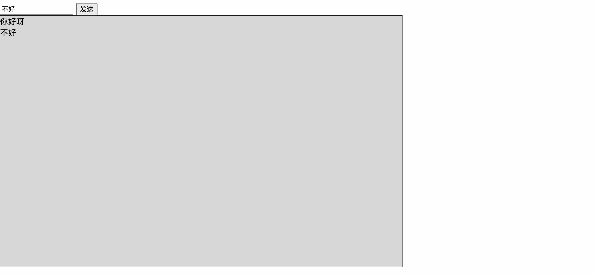

```
<!DOCTYPE html>
<html lang="en">
<head>
    <meta charset="UTF-8">
    <title>Title</title>
</head>
<body>

<div>
    <input type="text" placeholder="请输入内容" id="txt">
    <input type="button" value="发送" id="btn">
</div>
<div id="content-area" style="width: 800px;background-color: #dddddd;border: 1px solid #333;height: 500px;">

</div>
<script src="jquery-3.6.0.min.js"></script>
<script>
    $("#btn").click(function (){
        var content = $("#txt").val();
        if(content.length < 1){
            alert("输入不能为空");
            return;
        }

        var newDiv = $("<div>").text(content);

        // 在id=content-area的标签内部添加值。
        $("#content-area").append(newDiv);

    });

</script>
</body>
</html>
```


### 4.5 属性操作

```html
<a href="xxxx"></a>

```

```html
<a id="t1" href="https://www.baidu.com" name="x1">百度</a>


<script src="jquery-3.6.0.min.js"></script>
<script>
    var data = $("#t1").attr('href');
    console.log(data);
    $("#t1").attr('href',"https://www.bilibili.com");
</script>
```


### 4.6 prop属性

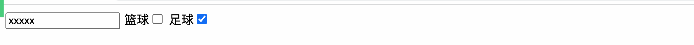

```html
<!DOCTYPE html>
<html lang="en">
<head>
    <meta charset="UTF-8">
    <title>Title</title>
</head>
<body>

<input type="text" id="v1"/>

篮球<input type="checkbox" id="v2" checked />
足球<input type="checkbox" id="v3" />

<script src="jquery-3.6.0.min.js"></script>
<script>
    $("#v1").val();
    $("#v1").val("xxxxx");

    $("#v2").prop("checked")
    $("#v2").prop("checked",false);
    $("#v3").prop("checked",true);

</script>
</body>
</html>
```

### 案例：表格全选

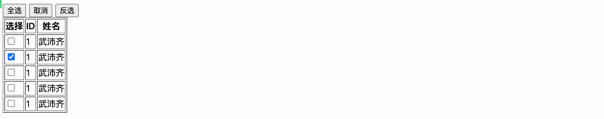

```html
<!DOCTYPE html>
<html lang="en">
<head>
    <meta charset="UTF-8">
    <title>Title</title>
</head>
<body>

<input type="button" value="全选" id="btnAll"/>
<input type="button" value="取消" id="btnClear"/>
<input type="button" value="反选" id="btnReverse"/>
<table border="1">
    <thead>
    <tr>
        <th>选择</th>
        <th>ID</th>
        <th>姓名</th>
    </tr>
    </thead>
    <tbody>
    <tr>
        <td><input type="checkbox"/></td>
        <td> 1</td>
        <td> 武沛齐</td>
    </tr>
    <tr>
        <td><input type="checkbox"/></td>
        <td> 1</td>
        <td> 武沛齐</td>
    </tr>
    <tr>
        <td><input type="checkbox"/></td>
        <td> 1</td>
        <td> 武沛齐</td>
    </tr>
    <tr>
        <td><input type="checkbox"/></td>
        <td> 1</td>
        <td> 武沛齐</td>
    </tr>
    <tr>
        <td><input type="checkbox"/></td>
        <td> 1</td>
        <td> 武沛齐</td>
    </tr>
    </tbody>
</table>

<script src="jquery-3.6.0.min.js"></script>
<script>
    $("#btnAll").click(function () {
        $("table input[type='checkbox']").prop('checked', true);
    })

    $("#btnClear").click(function () {
        $("table input[type='checkbox']").prop('checked', false);
    })

    $("#btnReverse").click(function () {
        $("table input[type='checkbox']").each(function () {
            /*
            var old = $(this).prop('checked');
            if (old) {
                $(this).prop('checked', false);
            } else {
                $(this).prop('checked', true);
            }
             */
            var old = $(this).prop('checked');
            $(this).prop('checked', !old);
        })
    })
</script>
</body>
</html>
```


### 4.7 文档操作

- 创建标签

  ```
  $("<div>")
  $("<a>")
  ```

- 添加：追加

  ```html
  <div id='content'>
      <div>adsf</div>
  	<div>嘻嘻嘻嘻嘻寻</div>
  </div>
  
  var tag = $("<div>").text("嘻嘻嘻嘻嘻寻");
  $("#content").append(tag);
  ```

- 添加：顶部插入

  ```html
  <div id='content'>
  	<div>嘻嘻嘻嘻嘻寻</div>
      <div>adsf</div>
  </div>
  
  var tag = $("<div>").text("嘻嘻嘻嘻嘻寻");
  $("#content").prepend(tag);
  ```

- 添加：外部插入 前/后

  ```html
  <div>嘻嘻嘻嘻嘻寻</div>
  <div id='content'>
      <div>adsf</div>
  </div>
  
  var tag = $("<div>").text("嘻嘻嘻嘻嘻寻");
  $("#content").before(tag);
  ```

  ```html
  <div id='content'>
      <div>adsf</div>
  </div>
  <div>嘻嘻嘻嘻嘻寻</div>
  
  var tag = $("<div>").text("嘻嘻嘻嘻嘻寻");
  $("#content").after(tag);
  ```

- 删除标签

  ```html
  <div id='v1'>
      <h1>
          sdfsd
      </h1>
      <ul id='menus'>
          <li>x1</li>
          <li id='xx'>x1</li>
          <li>x2</li>
          <li>x2</li>
      </ul>
  </div>
  
  $("#xx").remove()
  ```

- 清空文本内容

  ```html
  <div id='xxx'>
      asdfasdfasdf
  </div>
  
  $("#xxx").empty()
  ```

  注意：如果是input框清空  `$("#xxxxxx").val("")`


### 4.8 事件委托

```html
<!DOCTYPE html>
<html lang="en">
<head>
    <meta charset="UTF-8">
    <title>Title</title>
</head>
<body>
<input type="text" id="txt"/>
<input type="button" value="添加" id="btnAdd">

<ul id="dataList">
    <li>周六轮</li>
    <li>刘畊宏</li>
    <li>陈冠希</li>
</ul>

<script src="jquery-3.6.0.min.js"></script>
<script>
    $("#btnAdd").click(function () {
        $("#dataList").append($("<li>").text($("#txt").val()));
    });

    /*
    $("li").click(function () {
        $(this).remove();
    });
     */

    $("#dataList").on("click", "li", function () {
        $(this).remove();
    })

</script>
</body>
</html>
```


### 4.9 框架加载

```html
<script src="jquery-3.6.0.min.js"></script>
<script>
    // 推荐，当页面`框架`加载完整之后执行。
    $(function (){
        // 写在这里...
    })

</script>
```


```html
<!DOCTYPE html>
<html lang="en">
<head>
    <meta charset="UTF-8">
    <title>Title</title>
</head>
<body>
<input type="text" id="txt"/>
<input type="button" value="添加" id="btnAdd">

<ul id="dataList">
    <li>周六轮</li>
    <li>刘畊宏</li>
    <li>陈冠希</li>
</ul>

<script src="jquery-3.6.0.min.js"></script>
<script>
    $(function () {

        $("#btnAdd").click(function () {
            $("#dataList").append($("<li>").text($("#txt").val()));
        });

        bindLi();

    })

    function bindLi() {
        $("#dataList").on("click", "li", function () {
            $(this).remove();
        })
    }

</script>
</body>
</html>
```


## 5.BootStrap

https://v3.bootcss.com/css/

别人写好的：JavaScript、CSS代码，我们后期项目就可以在他的基础上进行开发。

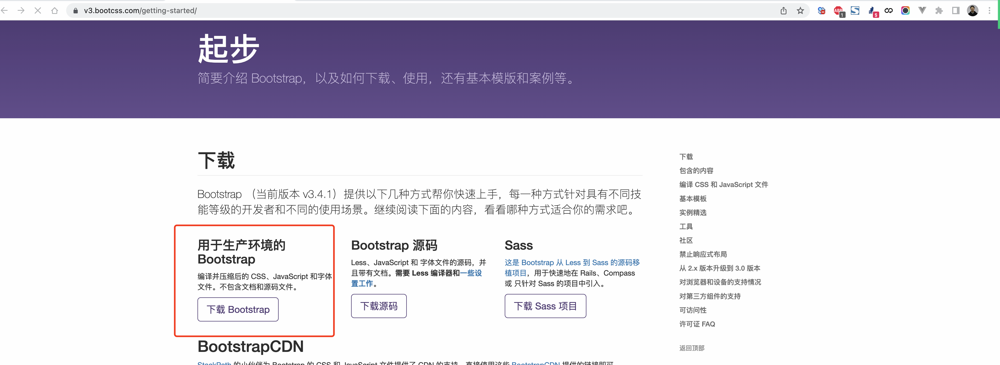


- 下载

- 引入

  ```html
  <!DOCTYPE html>
  <html lang="en">
  <head>
      <meta charset="UTF-8">
      <title>Title</title>
      <link rel="stylesheet" href="bootstrap-3.4.1/css/bootstrap.min.css">
  </head>
  <body>
  
  
  <script src="jquery-3.6.0.min.js"></script>
  <script src="bootstrap-3.4.1/js/bootstrap.min.js"></script>
  </body>
  </html>
  ```

- 使用

  - 看官方文档，示例。
  - 拿来直接用 & 改。

  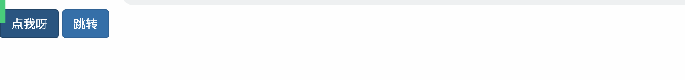

  ```html
  <!DOCTYPE html>
  <html lang="en">
  <head>
      <meta charset="UTF-8">
      <title>Title</title>
      <link rel="stylesheet" href="bootstrap-3.4.1/css/bootstrap.min.css">
  </head>
  <body>
  
  <input type="button" class="btn btn-primary" value="点我呀"/>
  <a class="btn btn-primary">跳转</a>
  
  <script src="jquery-3.6.0.min.js"></script>
  <script src="bootstrap-3.4.1/js/bootstrap.min.js"></script>
  </body>
  </html>
  ```


### 5.1 容器

-  container，容器居中。
-  container-fluid，平铺。

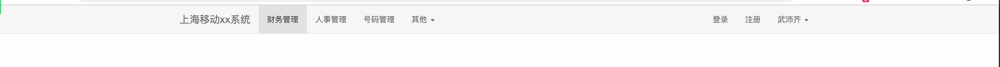

```html
<!DOCTYPE html>
<html lang="en">
<head>
    <meta charset="UTF-8">
    <title>Title</title>
    <link rel="stylesheet" href="bootstrap-3.4.1/css/bootstrap.min.css">
</head>
<body>

<div class="navbar navbar-default">
    <div class="container">
        <!-- Brand and toggle get grouped for better mobile display -->
        <div class="navbar-header">
            <button type="button" class="navbar-toggle collapsed" data-toggle="collapse"
                    data-target="#bs-example-navbar-collapse-1" aria-expanded="false">
                <span class="sr-only">Toggle navigation</span>
                <span class="icon-bar"></span>
                <span class="icon-bar"></span>
                <span class="icon-bar"></span>
            </button>
            <a class="navbar-brand" href="#">上海移动xx系统</a>
        </div>

        <!-- Collect the nav links, forms, and other content for toggling -->
        <div class="collapse navbar-collapse" id="bs-example-navbar-collapse-1">

            <ul class="nav navbar-nav">
                <li class="active"><a href="#">财务管理</a></li>
                <li><a href="#">人事管理</a></li>
                <li><a href="#">号码管理</a></li>
                <li class="dropdown">
                    <a href="#" class="dropdown-toggle" data-toggle="dropdown" role="button" aria-haspopup="true"
                       aria-expanded="false">其他 <span class="caret"></span></a>
                    <ul class="dropdown-menu">
                        <li><a href="#">功能1</a></li>
                        <li><a href="#">Another action</a></li>
                        <li><a href="#">Something else here</a></li>
                        <li role="separator" class="divider"></li>
                        <li><a href="#">Separated link</a></li>
                        <li role="separator" class="divider"></li>
                        <li><a href="#">One more separated link</a></li>
                    </ul>
                </li>
            </ul>
            
            <ul class="nav navbar-nav navbar-right">
                <li><a href="#">登录</a></li>
                <li><a href="#">注册</a></li>
                <li class="dropdown">
                    <a href="#" class="dropdown-toggle" data-toggle="dropdown" role="button" aria-haspopup="true"
                       aria-expanded="false">武沛齐 <span class="caret"></span></a>
                    <ul class="dropdown-menu">
                        <li><a href="#">个人资料</a></li>
                        <li><a href="#">修改密码</a></li>
                        <li role="separator" class="divider"></li>
                        <li><a href="#">注销</a></li>
                    </ul>
                </li>
            </ul>
        </div><!-- /.navbar-collapse -->
    </div><!-- /.container-fluid -->
</div>


<script src="jquery-3.6.0.min.js"></script>
<script src="bootstrap-3.4.1/js/bootstrap.min.js"></script>
</body>
</html>
```


### 5.2 栅格

总共划分为12等份。

- lg，1200

  ```
  <div class="col-lg-9" style="background-color: red;">左边</div>
  <div class="col-lg-3" style="background-color: green">右边</div>
  ```

- md，960

  ```
  <div class="col-md-9" style="background-color: red;">左边</div>
  <div class="col-md-3" style="background-color: green">右边</div>
  ```

- sm，768

  ```
  <div class="col-sm-9" style="background-color: red;">左边</div>
  <div class="col-sm-3" style="background-color: green">右边</div>
  ```

- xs

  ```
  <div class="col-xs-9" style="background-color: red;">左边</div>
  <div class="col-xs-3" style="background-color: green">右边</div>
  ```


补充：占位。

```html
<div class="col-md-offset-9 col-md-3" style="background-color: green">右边</div>
```


### 5.3 面板

```html
<!DOCTYPE html>
<html lang="en">
<head>
    <meta charset="UTF-8">
    <title>Title</title>
    <link rel="stylesheet" href="bootstrap-3.4.1/css/bootstrap.min.css">
</head>
<body>

<div class="navbar navbar-default">
    <div class="container">
        <!-- Brand and toggle get grouped for better mobile display -->
        <div class="navbar-header">
            <button type="button" class="navbar-toggle collapsed" data-toggle="collapse"
                    data-target="#bs-example-navbar-collapse-1" aria-expanded="false">
                <span class="sr-only">Toggle navigation</span>
                <span class="icon-bar"></span>
                <span class="icon-bar"></span>
                <span class="icon-bar"></span>
            </button>
            <a class="navbar-brand" href="#">上海移动xx系统</a>
        </div>

        <!-- Collect the nav links, forms, and other content for toggling -->
        <div class="collapse navbar-collapse" id="bs-example-navbar-collapse-1">

            <ul class="nav navbar-nav">
                <li class="active"><a href="#">财务管理</a></li>
                <li><a href="#">人事管理</a></li>
                <li><a href="#">号码管理</a></li>
                <li class="dropdown">
                    <a href="#" class="dropdown-toggle" data-toggle="dropdown" role="button" aria-haspopup="true"
                       aria-expanded="false">其他 <span class="caret"></span></a>
                    <ul class="dropdown-menu">
                        <li><a href="#">功能1</a></li>
                        <li><a href="#">Another action</a></li>
                        <li><a href="#">Something else here</a></li>
                        <li role="separator" class="divider"></li>
                        <li><a href="#">Separated link</a></li>
                        <li role="separator" class="divider"></li>
                        <li><a href="#">One more separated link</a></li>
                    </ul>
                </li>
            </ul>

            <ul class="nav navbar-nav navbar-right">
                <li><a href="#">登录</a></li>
                <li><a href="#">注册</a></li>
                <li class="dropdown">
                    <a href="#" class="dropdown-toggle" data-toggle="dropdown" role="button" aria-haspopup="true"
                       aria-expanded="false">武沛齐 <span class="caret"></span></a>
                    <ul class="dropdown-menu">
                        <li><a href="#">个人资料</a></li>
                        <li><a href="#">修改密码</a></li>
                        <li role="separator" class="divider"></li>
                        <li><a href="#">注销</a></li>
                    </ul>
                </li>
            </ul>
        </div><!-- /.navbar-collapse -->
    </div><!-- /.container-fluid -->
</div>

<div>
    <div class="container clearfix">
        <div class="col-md-9">

        </div>
        <div class="col-md-3">
            <div class="panel panel-default">
                <div class="panel-heading">
                    <span style="color: red;" class="glyphicon glyphicon-flag" aria-hidden="true"></span> 最新评论
                </div>
                <div class="panel-body">
                    <div>adf</div>
                    <div>adf</div>
                    <div>adf</div>
                    <div>adf</div>
                    <div>adf</div>
                    <div>adf</div>
                </div>
            </div>

            <div class="panel panel-default">
                <div class="panel-heading">24小时排行榜</div>
                <div class="panel-body">
                    <div>adf</div>
                    <div>adf</div>
                    <div>adf</div>
                    <div>adf</div>
                    <div>adf</div>
                    <div>adf</div>
                </div>
            </div>

            <div class="panel panel-default">
                <!-- Default panel contents -->
                <div class="panel-heading">Panel heading</div>
                <div class="panel-body">
                    <p>...</p>
                </div>

                <!-- List group -->
                <ul class="list-group">
                    <li class="list-group-item">Cras justo odio</li>
                    <li class="list-group-item">Dapibus ac facilisis in</li>
                    <li class="list-group-item">Morbi leo risus</li>
                    <li class="list-group-item">Porta ac consectetur ac</li>
                    <li class="list-group-item">Vestibulum at eros</li>
                </ul>
            </div>

        </div>
    </div>
</div>

<script src="jquery-3.6.0.min.js"></script>
<script src="bootstrap-3.4.1/js/bootstrap.min.js"></script>
</body>
</html>
```


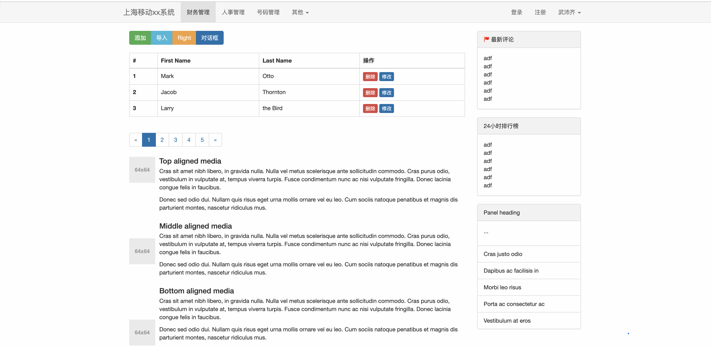


扩展：

- 前后端不分离：django+BootStrap  /  flask+BootStrap 
- 前后端分离：django+vue.js + elementui  /  flask+vue.js + elementui


