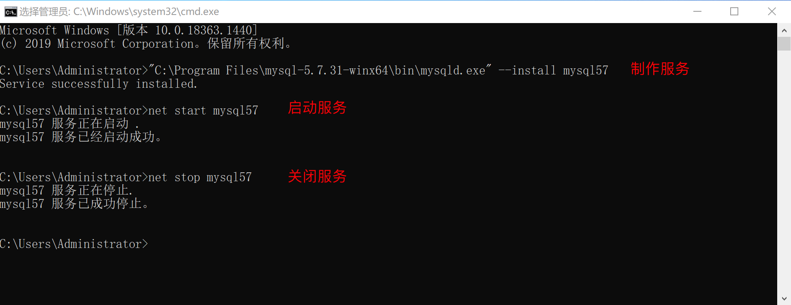
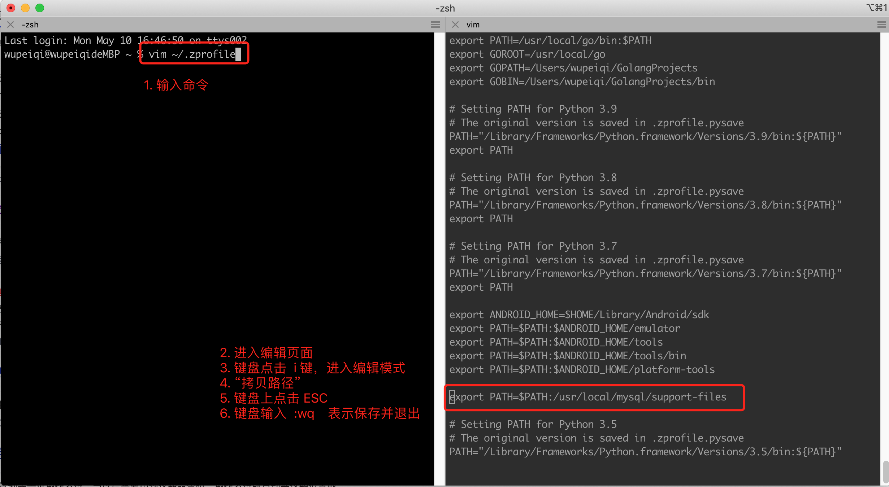

# day07 MySQL

mysql软件，帮助我们实现对电脑上 文件/文件件 进行管理。


## 1.安装&配置&启动


### 1.1 win系统


#### 第1步：下载安装

https://downloads.mysql.com/archives/community/


#### 第2步：解压至任意文件夹

建议解压至软件安装目录，例如：


#### 第3步：创建配置文件

在MySQL的安装目录下创建 `my.ini` 的文件，作为MySQL的配置文件。


其实，MySQL的配置文件可以放在很多的目录，下图是配置文件的优先级：


强烈，建议大家还是把配置文件放在MySQL安装目录下，这样以后电脑上想要安装多个版本的MySQL时，配置文件可以相互独立不影响。


注意：如果你电脑的上述其他目录存在MySQL配置文件，建议删除，否则可能会影响MySQL的启动。


#### 第4步：初始化


```
>>> "C:\Program Files\mysql-5.7.31-winx64\bin\mysqld.exe"  --initialize-insecure
```

初始化命令在执行时，会自动读取配置文件并执行初始化，此过程主要会做两件事：

- 自动创建data目录，以后我们的数据都会存放在这个目录。
- 同时创建建必备一些的数据，例如默认账户 root （无密码），用于登录MySQL并通过指令操作MySQL。


在windowns安装过程中如果有报错 （ msvcr120.dll不存在 ），请下载并安装下面的两个补丁：

- vcredist：https://www.microsoft.com/zh-cn/download/confirmation.aspx?id=40784  （主要）
  

- dirctx：https://www.microsoft.com/zh-CN/download/details.aspx?id=35
  


#### 第5步：启动

启动MySQL常见的有两种方式：

- 临时启动

  ```bash
  >>> "C:\Program Files\mysql-5.7.31-winx64\bin\mysqld.exe"
  ```

  

  注意：此时程序会挂起，内部就是可以接收客户端发来的MySQL指令，关闭窗口或Ctrl+c 就可以停止运行。

  这种启动方式每次开机或想要开启都需要手动执行一遍命令比较麻烦。

- 制作windows服务，基于windows服务管理。

  ```bash
  >>>"C:\Program Files\mysql-5.7.31-winx64\bin\mysqld.exe" --install mysql57
  ```

  

  创建好服务之后，可以通过命令 启动和关闭服务，例如：

  ```bash
  >>> net start mysql57
  >>> net stop mysql57
  ```

  也可以在window的服务管理中点击按钮启动和关闭服务。例如：

  

  

  

  

  以后不再想要使用window服务了，也可以将制作的这个MySQL服务删除。

  ```
  >>>"C:\Program Files\mysql-5.7.31-winx64\bin\mysqld.exe" --remove mysql57
  ```

  


#### 第6步：测试连接MySQL

安装并启动MySQL之后，就可以连接MySQL来测试是否已正确安装并启动成功。


以后在开发时，肯定是要用Python代码来连接MySQL并且进行数据操作（后面讲）。

在安装MySQL时，其实也自动安装了一个工具（客户端），让我们快速实现连接MySQL并发送指令。


注意：如果把bin目录加入环境变量，每次在运行命令时，就不用再重新输入绝对路径了。


上述过程如果操作完成之后，证明你的安装和启动过程就搞定了。


### 1.2 mac系统

mac系统和win不同，MySQL为他提供了非常方便的一站式安装程序，只要点击、next就可以安装、初始化完成。


#### 第1步：安装和初始化

https://downloads.mysql.com/archives/community/


这个基于dmg文件的安装过程，其实包含了：

- 安装，默认安装在了 `/usr/local/mysql-5.7.31-macos10.14-x86_64/`目录。
- 初始化，在安装目录下创建data目录用于存放数据； 初始化模块数据库以及账户相关等，例如： 账cd


#### 第2步：创建配置文件

建议在MySQL安装目录下创建 `etc/my.cnf` 作为MySQL的配置文件。


MySQL的配置文件按照优先级，会在以下目录中寻找：


为了避免多个版本共存时，配置文件混乱的问题，建议大家还是把配置文件放在当前MySQL的安装目录下。


#### 第3步：启动

在Mac系统中启动MySQL常见的有2种方式：

- 安装目录中自带 `mysql.server` 脚本（建议）

  ```python
  sudo /usr/local/mysql/support-files/mysql.server start
  # 输入电脑密码
  
  sudo mysql.server start
  # 输入电脑密码
  ```

  ```
  sudo /usr/local/mysql/support-files/mysql.server stop
  ```

  


  为了避免每次执行命令都需要些路径，可以将路径 `/usr/local/mysql/support-files`加入到环境变量中。



  操作完成之后，再在终端执行下命令：`source ~/.zprofile` 让设置的环境变量立即生效。

  注意：mac系统的版本如果比较老，会显示空白的 `zprofile` 文件，此就要去打开   `bash_profile` 文件。


  这样设置好之后，以后就可以使用下面的命令去启动和关闭MySQL了。

  ```
sudo mysql.server start
sudo mysql.server stop
  ```

  

- 系统偏好设置（不推荐）


第一种`mysql.server`脚本的形式，内部是使用 `mysqld_safe`运行，可以守护我们的MySQL进程，如意外挂掉可自动重启。


#### 第4步：测试连接MySQL

安装并启动MySQL之后，就可以连接MySQL来测试是否已正确安装并启动成功。


以后在开发时，肯定是要用Python代码来连接MySQL并且进行数据操作（后面讲）。

在安装MySQL时，其实也自动安装了一个工具（客户端），让我们快速实现连接MySQL并发送指令。


注意：`/usr/local/mysql/bin`也可以加入到环境变量。


至此，在Mac系统中关于MySQL的安装和配置就完成了。


### 1.3 关于密码


#### 1. 设置和修改root密码

在windows系统中模块默认 root 账户是没有密码的，如果想要为账户设定密码，可以在利用root账户登录成功之后，执行：


#### 2. 忘记root密码

如果你忘记了MySQL账户的密码。

- 修改配置文件，在 [mysqld] 节点下添加 `skip-grant-tables=1`

  ```
  [mysqld]
  ...
  skip-grant-tables=1
  ...
  ```

- 重启MySQL，再次登录时，不需要密码直接可以进去了

  - windows重启

    ```
    net stop mysql57
    net start mysql57
    ```

  - mac重启

    ```
    sudo mysql.server restart
    ```

  重启后，无序密码就可以进入。

  ```
  >>> mysql -u root -p
  ```

- 进入数据库后执行修改密码命令

  ```
  use mysql;
  update user set authentication_string = password('新密码'),password_last_changed=now() where user='root';
  
  exit;
  ```

- 退出并再次修改配置文件，删除 [mysqld] 节点下的 `skip-grant-tables=1`

  ```
  [mysqld]
  ...
  # skip-grant-tables=1
  ...
  ```

- 再次重启，以后就可以使用新密码登录了。


## 2.数据库管理（文件夹）


当连接上MySQL之后，执行如下指令（一般称为SQL语句），就可以对MySQL的数据进行操作。

- 查看当前所有的数据库：  `show databases;`

- 创建数据库：`create database 数据库名 DEFAULT CHARSET utf8 COLLATE utf8_general_ci;` 

  ```
  create database day07 DEFAULT CHARSET utf8 COLLATE utf8_general_ci;
  ```

- 删除数据库：`drop database 数据库名`;

- 进入数据（进入文件）：`use 数据库;`


如果像通过python代码去发送请求并让MySQL帮助我们对数据库进行操作。

```
pip install pymysql
```

```python
import pymysql

# 连接MySQL（socket）
conn = pymysql.connect(host='127.0.0.1', port=3306, user='root', passwd='root123', charset="utf8")
cursor = conn.cursor()

# 1.查看数据库
"""
cursor.execute("show databases;")
result = cursor.fetchall()
print(result)
"""

# 2.删除数据库
"""
cursor.execute("drop database gx_day15;")
conn.commit()
"""

# 3.进入数据库
"""
cursor.execute("use blog;")
cursor.execute("show tables;")
result = cursor.fetchall()
print(result)
"""

# 4.创建数据库
"""
cursor.execute("create database day08 DEFAULT CHARSET utf8 COLLATE utf8_general_ci;")
conn.commit()
"""

# 关闭连接
cursor.close()
conn.close()
```


## 3.数据表 管理

- 进入数据库  `use 数据库;`

- 查看当前所有的数据表：`show tables;`

- 创建表
  

  ```mysql
  create table 表名(
      列名 类型 ,
      列名 类型, 
      列名 类型, 
      列名 类型
  )default charset=utf8;
  ```

  ```mysql
  create table tb1(
  	id int,
      name varchar(16)
  )default charset=utf8;
  ```

  ```mysql
  create table tb2(
  	id int,
      name varchar(16) not null,   -- 不允许为空
      email varchar(32) null,      -- 允许为空（默认）
      age int
  )default charset=utf8;
  ```

  ```mysql
  create table tb3(
  	id int,
      name varchar(16) not null,   -- 不允许为空
      email varchar(32) null,      -- 允许为空（默认）
      age int default 3            -- 插入数据时，如果不给age列设置值，默认值：3
  )default charset=utf8;
  ```

  ```mysql
  create table tb4(
  	id int primary key,			 -- 主键（不允许为空、不能重复）
      name varchar(16) not null,   -- 不允许为空
      email varchar(32) null,      -- 允许为空（默认）
      age int default 3            -- 插入数据时，如果不给age列设置值，默认值：3
  )default charset=utf8;
  ```

  ```mysql
  create table tb5(
  	id int not null auto_increment primary key,	-- 不允许为空 & 主键 & 自增
      name varchar(16) not null,   		-- 不允许为空
      email varchar(32) null,      		-- 允许为空（默认）
      age int default 3            		-- 插入数据时，如果不给age列设置值，默认值：3
  )default charset=utf8;
  ```

- 删除表

  ```
  drop table 表名;
  ```

- 清空表

  ```
  delete from 表名; 
  truncate table 表名;    --（速度快、无法回滚撤销等）
  ```

- 常见列类型

  ```sql
  create table 表(
  	id int,
      name varchar(16)
  )default charset=utf8;
  ```

  - `int[(m)][unsigned][zerofill]`

    ```
    int				表示有符号，取值范围：-2147483648 ～ 2147483647
    int unsigned	表示无符号，取值范围：0 ～ 4294967295
    ```

    ```sql
    mysql> create table L1(id int, uid int unsigned) default charset=utf8;
    Query OK, 0 rows affected (0.03 sec)
    
    mysql> insert into L1(id,uid) values(1,2);
    Query OK, 1 row affected (0.00 sec)
    
    mysql> insert into L1(id,uid) values(214748364100,4294967294);
    ERROR 1264 (22003): Out of range value for column 'id' at row 1
    mysql>
    ```

  - `tinyint[(m)] [unsigned] [zerofill]`

    ```
    有符号，取值范围：-128 ～ 127.
    无符号，取值范围：0 ～ 255
    ```

  - `bigint[(m)][unsigned][zerofill]`

    ```
    有符号，取值范围：-9223372036854775808 ～ 9223372036854775807
    无符号，取值范围：0  ～  18446744073709551615
    ```

  - `decimal[(m[,d])] [unsigned] [zerofill]`

    ```
    准确的小数值，m是数字总个数（负号不算），d是小数点后个数。 m最大值为65，d最大值为30。
    
    例如：
    create table L2(
    	id int not null primary key auto_increment,
    	salary decimal(8,2)
    )default charset=utf8;
    ```

    ```sql
    mysql> create table L2(id int not null primary key auto_increment,salary decimal(8,2))default charset=utf8;
    Query OK, 0 rows affected (0.03 sec)
    
    mysql> insert into L2(salary) values(1.28);
    Query OK, 1 row affected (0.01 sec)
    
    mysql> insert into L2(salary) values(5.289);
    Query OK, 1 row affected, 1 warning (0.00 sec)
    
    mysql> insert into L2(salary) values(5.282);
    Query OK, 1 row affected, 1 warning (0.00 sec)
    
    mysql> insert into L2(salary) values(512132.28);
    Query OK, 1 row affected (0.00 sec)
    
    mysql> insert into L2(salary) values(512132.283);
    Query OK, 1 row affected, 1 warning (0.00 sec)
    
    mysql> select * from L2;
    +----+-----------+
    | id | salary    |
    +----+-----------+
    |  1 |      1.28 |
    |  2 |      5.29 |
    |  3 |      5.28 |
    |  4 | 512132.28 |
    |  5 | 512132.28 |
    +----+-----------+
    5 rows in set (0.00 sec)
    
    mysql> insert into L2(salary) values(5121321.283);
    ERROR 1264 (22003): Out of range value for column 'salary' at row 1
    mysql>
    ```

  - `FLOAT[(M,D)] [UNSIGNED] [ZEROFILL]`

    ```
    单精度浮点数，非准确小数值，m是数字总个数，d是小数点后个数。
    ```

  - `DOUBLE[(M,D)] [UNSIGNED] [ZEROFILL]`

    ```
    双精度浮点数（非准确小数值），m是数字总个数，d是小数点后个数。
    ```

  - `char(m)`

    ```
    定长字符串，m代表字符串的长度，最多可容纳255个字符。
    
    定长的体现：即使内容长度小于m，也会占用m长度。例如：char(5)，数据是：yes，底层也会占用5个字符；如果超出m长度限制（默认MySQL是严格模式，所以会报错）。
        如果在配置文件中加入如下配置，
            sql-mode="NO_AUTO_CREATE_USER,NO_ENGINE_SUBSTITUTION"
        保存并重启，此时MySQL则是非严格模式，此时超过长度则自动截断（不报错）。。
    
    注意：默认底层存储是固定的长度（不够则用空格补齐），但是查询数据时，会自动将空白去除。 如果想要保留空白，在sql-mode中加入 PAD_CHAR_TO_FULL_LENGTH 即可。
    查看模式sql-mode，执行命令：show variables  like 'sql_mode';
    
    一般适用于：固定长度的内容。
    
    create table L3(
        id int not null primary key auto_increment,
        name varchar(5),
        depart char(3)
    )default charset=utf8;
    
    insert into L3(name,depart) values("alex","alexx");
    
    
    ```

  - `varchar(m)`

    ```
    变长字符串，m代表字符串的长度，最多可容纳65535个字节。
    
    变长的体现：内容小于m时，会按照真实数据长度存储；如果超出m长度限制（（默认MySQL是严格模式，所以会报错）。
        如果在配置文件中加入如下配置，
            sql-mode="NO_AUTO_CREATE_USER,NO_ENGINE_SUBSTITUTION"
        保存并重启，此时MySQL则是非严格模式，此时超过长度则自动截断（不报错）。
    
    例如：
    create table L3(
        id int not null primary key auto_increment,
        name varchar(5),
        depart char(3)
    )default charset=utf8;
    ```

    ```sql
    mysql> create table L3(id int not null primary key auto_increment,name varchar(5),depart char(3))default charset=utf8;
    Query OK, 0 rows affected (0.03 sec)
    
    -- 插入多行
    mysql> insert into L3(name,depart) values("wu","WU"),("wupei","ALS");
    Query OK, 2 rows affected (0.00 sec)
    Records: 2  Duplicates: 0  Warnings: 0
    
    mysql> select * from L3;
    +----+-------+--------+
    | id | name  | depart |
    +----+-------+--------+
    |  1 | wu    | WU     |
    |  2 | wupei | ALS    |
    +----+-------+--------+
    2 rows in set (0.00 sec)
    
    -- 非严格模式下，不会报错。
    mysql> insert into L3(name,depart) values("wupeiqi","ALS");
    ERROR 1406 (22001): Data too long for column 'name' at row 1
    mysql> insert into L3(name,depart) values("wupei","ALSB");
    ERROR 1406 (22001): Data too long for column 'depart' at row 1
    mysql>
    
    -- 如果 sql-mode 中加入了 PAD_CHAR_TO_FULL_LENGTH ，则查询时char时空白会保留。
    mysql> select name,length(name),depart,length(depart) from L3;
    +-------+--------------+--------+----------------+
    | name  | length(name) | depart | length(depart) |
    +-------+--------------+--------+----------------+
    | wu    |            2 | WU     |              3 |
    | wupei |            5 | ALS    |              3 |
    +-------+--------------+--------+----------------+
    4 rows in set (0.00 sec)
    mysql>
    ```

  - `text`

    ```
    text数据类型用于保存变长的大字符串，可以组多到65535 (2**16 − 1)个字符。
    
    一般情况下，长文本会用text类型。例如：文章、新闻等。
    ```

    ```sql
    create table L4(
    	id int not null primary key auto_increment,
        title varchar(128),
    	content text
    )default charset=utf8;
    ```

  - `mediumtext`

    ```
    A TEXT column with a maximum length of 16,777,215 (2**24 − 1) characters.
    ```

  - `longtext`

    ```
    A TEXT column with a maximum length of 4,294,967,295 or 4GB (2**32 − 1)
    ```

    

  - `datetime`

    ```
    YYYY-MM-DD HH:MM:SS（1000-01-01 00:00:00/9999-12-31 23:59:59）
    ```

  - `date`

    ```
    YYYY-MM-DD（1000-01-01/9999-12-31）
    ```

  - `time`

    ```
    HH:MM:SS（'-838:59:59'/'838:59:59'）
    ```

  MySQL还有很多其他的数据类型，例如：*set、enum、TinyBlob、Blob、MediumBlob、LongBlob 等*，详细见官方文档：https://dev.mysql.com/doc/refman/5.7/en/data-types.html


上述就是关于数据表的一些基本操作。


python代码对表进行操作：

```python
import pymysql

# 连接MySQL（socket）
conn = pymysql.connect(host='127.0.0.1', port=3306, user='root', passwd='root123', charset="utf8", db='day07')
cursor = conn.cursor()

# 1.创建表
# sql = """create table tb6(
#  id int not null auto_increment primary key,
#     name varchar(16) not null,
#     email varchar(32) null,
#     age int default 3
# )default charset=utf8;"""
# cursor.execute(sql)
# conn.commit()

# 2.删除表
# cursor.execute("drop table tb6;")
# conn.commit()

# 3.清空
# cursor.execute("delete from tb5;")
# conn.commit()


# 关闭连接
cursor.close()
conn.close()
```


## 4.数据行管理

当数据库和数据表创建完成之后，就需要对数据表中的内容进行：增、删、改、查了。


- 新增

  ```mysql
  insert into tb5(name,email,age) values('x','x',19);
  insert into tb5(name,email,age) values('x','x',19),('x3','x3',30),('x4','x4',30);
  ```

- 查看

  ```mysql
  select * from tb5;
  select id,name from tb5;
  ```

  ```mysql
  select * from tb5 where id=9;
  select * from tb5 where age=9;
  select * from tb5 where id>5;
  select * from tb5 where id>5 and age=30;
  select * from tb5 where id=9 or id =6;
  ```

- 删除

  ```mysql
  delete from tb5;
  delete from tb5 where id=7;
  delete from tb5 where id=7;
  ```

- 修改

  ```mysql
  update tb5 set age=10;
  update tb5 set age=20 where id=8;
  update tb5 set name="wupeiqi",email='xxx@livec.om' where id=9;
  ```

  

### 实操

- 一次性操作

  - MySQ启动
  - 工具连接mysql
  - 创建数据库：day07
  - 进入数据库：use day07
  - 创建数据表：tb5

- 经常做

  - 在数据表中 增删改查 

  


在python代码中对数据行进行操作：

```python
import pymysql
from pymysql.cursors import DictCursor

# 连接MySQL（socket）
conn = pymysql.connect(host='127.0.0.1', port=3306, user='root', passwd='root123', charset="utf8", db='day07')
# cursor = conn.cursor()
cursor = conn.cursor(cursor=DictCursor)

# 1.新增数据
# cursor.execute("insert into tb5(name,email,age) values('武沛齐','xx',19);")
# conn.commit()

# 2.删除
# cursor.execute("delete from tb5 where id=8;")
# conn.commit()

# 3.更新
# cursor.execute("update tb5 set age=20 where id>7;")
# conn.commit()

# 4.查询
# cursor.execute("select * from tb5")
# data_list = cursor.fetchall()
# # ( (6, 'x', 'x', 10), (9, 'wupeiqi', 'xxx@livec.om', 20), (10, '武沛齐', 'xx', 20) )
# # [{'id': 6, 'name': 'x', 'email': 'x', 'age': 10}, {'id': 9, 'name': 'wupeiqi', 'email': 'xxx@livec.om', 'age': 20}, {'id': 10, 'name': '武沛齐', 'email': 'xx', 'age': 20}]
# print(data_list)

cursor.execute("select * from tb5")
data_list = cursor.fetchone()
# {'id': 6, 'name': 'x', 'email': 'x', 'age': 10}
print(data_list)


# 关闭连接
cursor.close()
conn.close()
```


## 5.案例：登录注册

需求：

- 用户输入用户名、密码进行注册，连接数据库，用户名和密码写入到数据库表中。
- 用户输入用户名、密码，去数据表中进行校验。

如何做呢？

- MySQL服务启动起来

- 【终端工具】创建数据库

  ```
  create database cmcc DEFAULT CHARSET utf8 COLLATE utf8_general_ci;
  ```

- 【终端工具】创建表

  ```mysql
  create table userinfo(
  	id int not null auto_increment primary key,	-- 不允许为空 & 主键 & 自增
      user varchar(16) not null,   		-- 不允许为空
      pwd varchar(32) not null,      		-- 允许为空（默认）
      age int
  )default charset=utf8;
  ```

- 代码连接数据库 & 操作表

  ```python
  import pymysql
  from pymysql.cursors import DictCursor
  
  username = input("用户名：")
  password = input("密码：")
  age = input("年龄：")
  
  # 1.连接
  conn = pymysql.connect(host='127.0.0.1', port=3306, user='root', passwd='root123', charset="utf8", db='cmcc')
  cursor = conn.cursor(cursor=DictCursor)
  
  # 2.执行SQL语句（指令）
  #   注意：SQL语句不要用之前的字符串格式化来进行操作。
  cursor.execute("insert into userinfo(user,pwd,age)values(%s,%s,%s);", [username, password, age])
  conn.commit()
  
  # 3.关闭连接
  cursor.close()
  conn.close()
  ```

  ```python
  import pymysql
  from pymysql.cursors import DictCursor
  
  username = input("用户名：")
  password = input("密码：")
  
  # 1.连接
  conn = pymysql.connect(host='127.0.0.1', port=3306, user='root', passwd='root123', charset="utf8", db='cmcc')
  cursor = conn.cursor(cursor=DictCursor)
  
  # 2.执行SQL语句（指令）
  #   注意：SQL语句不要用之前的字符串格式化来进行操作。
  cursor.execute("select * from userinfo where user=%s and pwd=%s", [username, password])
  result = cursor.fetchone()
  
  # 3.关闭连接
  cursor.close()
  conn.close()
  
  if result:
      print("登录成功")
  else:
      print("登录失败")
  ```

  

## 6.关于SQL注入


```python
import pymysql
from pymysql.cursors import DictCursor

username = input("用户名：")  # x' or 1=1 -- 
password = input("密码：")

# 1.连接
conn = pymysql.connect(host='127.0.0.1', port=3306, user='root', passwd='root123', charset="utf8", db='cmcc')
cursor = conn.cursor(cursor=DictCursor)

# 2.执行SQL语句（指令）
#   注意：SQL语句不要用之前的字符串格式化来进行操作。
sql = "select * from userinfo where user='%s' and pwd='%s'" % (username, password)

cursor.execute(sql)
result = cursor.fetchone()
print(result)
# 3.关闭连接
cursor.close()
conn.close()

if result:
    print("登录成功")
else:
    print("登录失败")
```


推荐使用：

```python
import pymysql
from pymysql.cursors import DictCursor

username = input("用户名：")  # x' or 1=1 --
password = input("密码：")

# 1.连接
conn = pymysql.connect(host='127.0.0.1', port=3306, user='root', passwd='root123', charset="utf8", db='cmcc')
cursor = conn.cursor(cursor=DictCursor)

# 2.执行SQL语句（指令）
#   注意：SQL语句不要用之前的字符串格式化来进行操作。
cursor.execute("select * from userinfo where user=%s and pwd=%s", [username, password])
result = cursor.fetchone()
print(result)
# 3.关闭连接
cursor.close()
conn.close()

if result:
    print("登录成功")
else:
    print("登录失败")
```


## 7.必备SQL语句

平时开发过程中，经常会使用到的指令（SQL语句）。


例如：现在创建如下两张表。


```sql
create database day07_sql default charset utf8 collate utf8_general_ci;
use day07_sql;
```

```sql
create table depart(
	id int not null auto_increment primary key,
    title varchar(16) not null
)default charset=utf8;


create table info(
	id int not null auto_increment primary key,
    name varchar(16) not null,
    email varchar(32) not null,
    age int,
    depart_id int
)default charset=utf8;
```

```sql
insert into depart(title) values("开发"),("运营"),("销售");

insert into info(name,email,age,depart_id) values("武沛齐","wupeiqi@live.com",19,1);
insert into info(name,email,age,depart_id) values("于超","pyyu@live.com",49,1);
insert into info(name,email,age,depart_id) values("alex","alex@live.com",9,2);
insert into info(name,email,age,depart_id) values("tony","tony@live.com",29,1);
insert into info(name,email,age,depart_id) values("kelly","kelly@live.com",99,3);
insert into info(name,email,age,depart_id) values("james","james@live.com",49,1);
insert into info(name,email,age,depart_id) values("李杰","lijie@live.com",49,1);
```


### 7.1 条件


```mysql
select * from info where age > 30;
select * from info where id >= 3;
select * from info where id != 3;
select * from info where id != 3 and name="武沛齐";

select * from info where id between 2 and 4; 
select * from info where id in (1,5,7,10);

select * from info where (name="武沛齐" and email="wupeiqi@live.com") or id=6;

select * from info where info.id >= 3;
```


### 7.2 通配符

一般用于模糊搜索。


```sql
select * from info where name like "%沛%";
select * from info where name like "%沛";
select * from info where email like "%@live.com";
select * from info where name like "武%齐";
select * from info where name like "k%y";
select * from info where email like "wupeiqi%";

select * from info where name like "_沛齐";
select * from info where name like "__齐";
select * from info where email like "_@live.com";
select * from info where email like "_upeiqi@live.com";
select * from info where email like "__peiqi@live.com";
select * from info where email like "__peiqi_live.co_";
```

注意：数量少，数据量大的搜索。


### 7.3 映射


```mysql
select * from info;
select id, name from info;
select id, name as n1 from info;
select info.id, info.name as n1 from info;

建议：不要用*
```


### 7.4 排序


```mysql
select * from info order by id desc;
select * from info order by id asc;


select * from info order by age asc, id desc;
```


### 7.5 部分数据


```mysql
select * from info limit 3;
select * from info order by id desc limit 3;
select * from info where id>2 order by id desc limit 3;


select * from info limit 2 offset 2;


select * from info limit 2 offset 0;
select * from info limit 2 offset 2;
select * from info limit 2 offset 4;
select * from info limit 2 offset 6;
```


### 7.6 分组


```mysql
select  age, count(id)  from info group by age;
select  depart_id, count(id)  from info group by depart_id;

select depart_id, count(id),sum(age),avg(age)  from info group by depart_id;
select depart_id, count(id) as ct,sum(age),avg(age),max(age),min(id) from info group by depart_id;
```

根据聚合条件再次搜索，一定要用having

```mysql
# 先筛选
# 再分组
select  depart_id, count(id)  from info where id>3 group by depart_id;
```

```mysql
# 先分组
# 分组结果筛选
select depart_id, count(id)  from info group by depart_id having count(id) > 1;
```


### 7.7 连表


```mysql
主表 left outer join 从表 on 主表.x = 从表.x
```

```mysql
select * from info   left outer join depart on info.depart_id = depart.id;
select * from depart left outer join info on info.depart_id = depart.id;
```


```
表 inner join 表 on 表.x = 表.x
```

```mysql
select * from info inner join depart on info.depart_id = depart.id;
select * from depart inner join info on info.depart_id = depart.id;
```


**连表操作的目的**，展示两张表中的数据，例如：查询所有的用户信息  姓名、部门名称

```mysql
select info.name,depart.title from info left join depart on info.depart_id=depart.id;
```


## 8.表关系

在开发项目时，需要根据业务需求去创建很多的表结构，以此来实现业务逻辑，一般表结构有三类：

- 单表，单独一张表就可以将信息保存。
  
- 一对多，需要两张表来存储信息，且两张表存在 `一对多` 或 `多对一`关系。
  
- 多对多，需要三张表来存储信息，两张单表 + 关系表，创造出两个单表之间`多对多关系`。
  


关于约束的问题（约束，depart_id值，必须是depart表中已存在id）。 --> 外键约束。


```mysql
create table depart1(
	id int not null auto_increment primary key,
    title varchar(16) not null
)default charset=utf8;


create table info1(
	id int not null auto_increment primary key,
    name varchar(16) not null,
    email varchar(32) not null,
    age int,
    depart_id int,
    constraint fk_info_depart foreign key (depart_id) references depart1(id)
)default charset=utf8;
```

```mysql
insert into depart1(title)values("开发");
insert into info1(name,email,age,depart_id) values("武沛齐","wupeiqi@live.com",19,1);
```


```mysql
create table boy(
	id int not null auto_increment primary key,
    name varchar(16) not null
)default charset=utf8;

create table girl(
	id int not null auto_increment primary key,
    name varchar(16) not null
)default charset=utf8;


create table boy_girl(
	id int not null auto_increment primary key,
    boy_id int not null,
    girl_id int not null,
    constraint fk_boy_girl_boy foreign key boy_girl(boy_id) references boy(id),
    constraint fk_boy_girl_girl foreign key boy_girl(girl_id) references girl(id)
)default charset=utf8;
```


## 9.工具 navicat

- navicat可视化工具。
- 终端，利用mysql.exe连接MySQL并执行SQL语句。
- Python代码。


navicat，是一个桌面应用，让我们可以更加方便的管理MySQL数据库。

- mac系统：https://www.macdo.cn/17030.html
- win系统：
  - 链接: https://pan.baidu.com/s/13cjbrBquz9vjVqKgWoCQ1w  密码: qstp
  - 链接: https://pan.baidu.com/s/1JULIIwQA5s0qN98KP8UXHA  密码: p18f


## 10.关于授权

默认情况下，我们连接MySQL时候，用的是 root 账户。

- A项目：

  - 创建数据库
  - 创建用户
  - 用户授权，用户只能对自己的数据库操作。

- B项目：

  - 创建数据库

  - 创建用户

  - 用户授权，用户只能对自己的数据库操作。

    

公司的DBA管理数据库。


### 10.1 用户管理


```
create user '用户名'@'连接者的IP地址' identified by '密码';
```

```mysql
create user wupeiqi1@127.0.0.1 identified by 'root123';
drop user wupeiqi1@127.0.0.1;

create user wupeiqi2@'127.0.0.%' identified by 'root123';
drop user wupeiqi2@'127.0.0.%';

create user wupeiqi3@'%' identified by 'root123';
drop user wupeiqi3@'%';

create user 'wupeiqi4'@'%' identified by 'root123';
drop user 'wupeiqi4'@'%';
```

```
create user guangzhao@'%' identified by 'root123';
```


### 10.2 授权

```
grant 权限 on 数据库.表 to '用户'@'IP地址'
```

```mysql
grant all privileges on day07_db.* TO  guangzhao@'%';
flush privileges;
```

- 关于权限

  ```
  all privileges  除grant外的所有权限
  select          仅查权限
  select,insert   查和插入权限
  ...
  usage                   无访问权限
  alter                   使用alter table
  alter routine           使用alter procedure和drop procedure
  create                  使用create table
  create routine          使用create procedure
  create temporary tables 使用create temporary tables
  create user             使用create user、drop user、rename user和revoke  all privileges
  create view             使用create view
  delete                  使用delete
  drop                    使用drop table
  execute                 使用call和存储过程
  file                    使用select into outfile 和 load data infile
  grant option            使用grant 和 revoke
  index                   使用index
  insert                  使用insert
  lock tables             使用lock table
  process                 使用show full processlist
  select                  使用select
  show databases          使用show databases
  show view               使用show view
  update                  使用update
  reload                  使用flush
  shutdown                使用mysqladmin shutdown(关闭MySQL)
  super                   􏱂􏰈使用change master、kill、logs、purge、master和set global。还允许mysqladmin􏵗􏵘􏲊􏲋调试登陆
  replication client      服务器位置的访问
  replication slave       由复制从属使用
  ```

- 关于数据库

  ```
  grant all privileges on day07_db.big TO  guangzhao@'%';
  grant all privileges on *.* TO  guangzhao@'%';
  ```


## 11.整合案例

需求：数据库中存储了很多手机号信息，例如：ID、手机号、归属地、姓名。

- 前端知识

- Flask框架

- MySQL操作数据库

  ```mysql
  create database day07_site DEFAULT CHARSET utf8 COLLATE utf8_general_ci;
  ```

  ```mysql
  create table phone(
  	id int not null auto_increment primary key,
      mobile varchar(11) not null,
      city varchar(32) not null,
      name varchar(32) not null
  )default charset=utf8;
  ```

  ```mysql
  insert into phone(mobile,city,name)values("15122233333","北京","武沛齐");
  insert into phone(mobile,city,name)values("15122233334","上海","罗浮");
  insert into phone(mobile,city,name)values("15122233335","深圳","光照");
  insert into phone(mobile,city,name)values("15122233336","上海","理解");
  insert into phone(mobile,city,name)values("15122233336","上海","李杰");
  ```

  ```mysql
  create user shanghai@'%' identified by 'root123';
  grant all privileges on day07_site.* TO  shanghai@'%';
  flush privileges;
  ```

  


