# day09 Django进阶


## 1.Cookie和Session

项目登录相关。

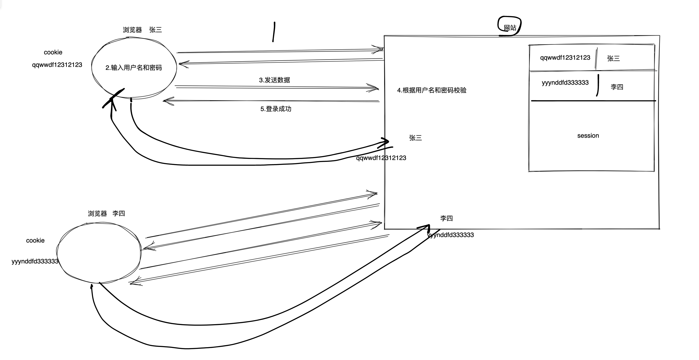


我给你项目，你在自己电脑上想要运行:

- 我

  ```
  项目打包，代码+数据库
  ```

- 大家

  ```
  - 下载压缩包
  - 解压
  - 打开
  ```


## 2.中间件

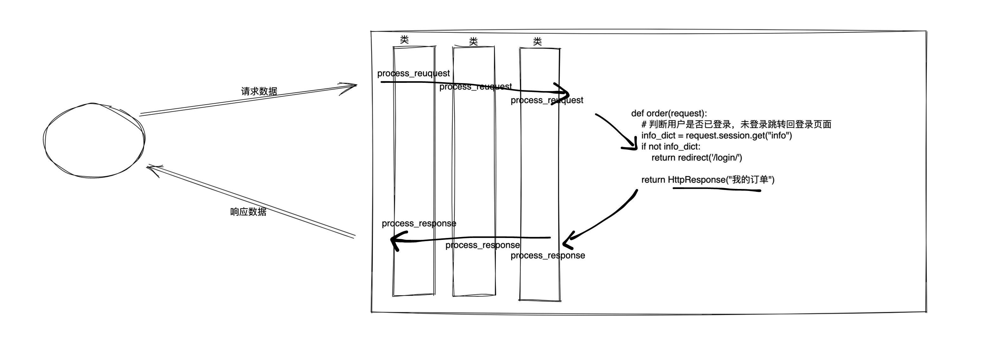

```python
MIDDLEWARE = [
    'django.middleware.security.SecurityMiddleware',
    'django.contrib.sessions.middleware.SessionMiddleware',
    'django.middleware.common.CommonMiddleware',
    'django.middleware.csrf.CsrfViewMiddleware',
    'django.contrib.auth.middleware.AuthenticationMiddleware',
    'django.contrib.messages.middleware.MessageMiddleware',
    'django.middleware.clickjacking.XFrameOptionsMiddleware',
]
```

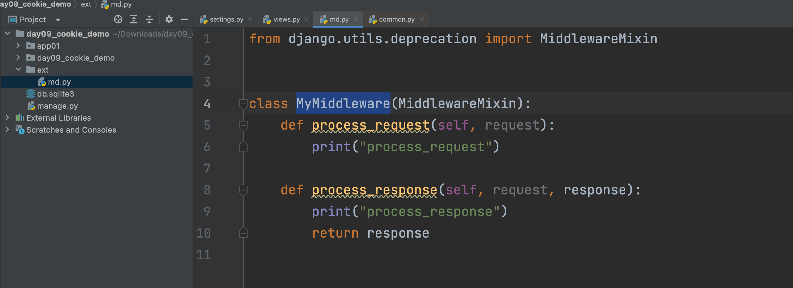

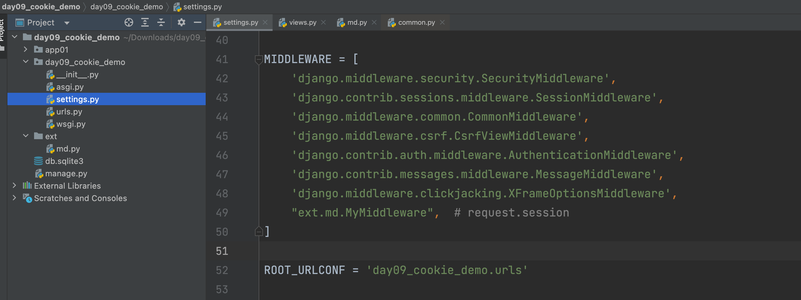


特点：所有的请求都会经过中间件。


问题来了：假设你写了项目有100URL->100函数，99个需要登录成功之后才能查看。

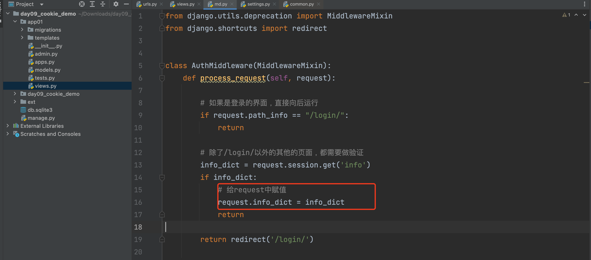

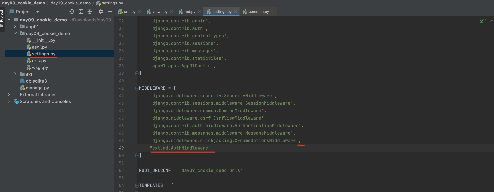

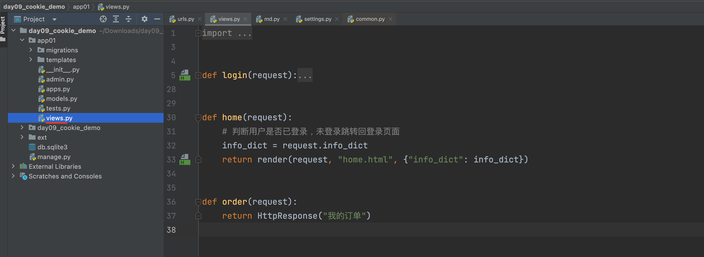


对于静态文件：

```
http://127.0.0.1:8000/static/1.png
```

注意：其他框架中可能遇到此问题，就要再中间件中特殊处理下即可。


## 3.母版的概念

例如：基于bootstrap写了5个页面，每个页面都有顶部导航。

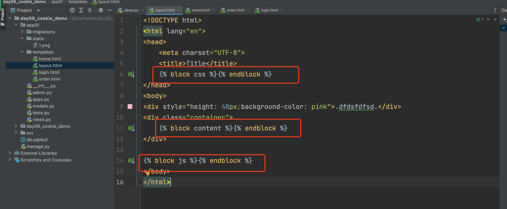

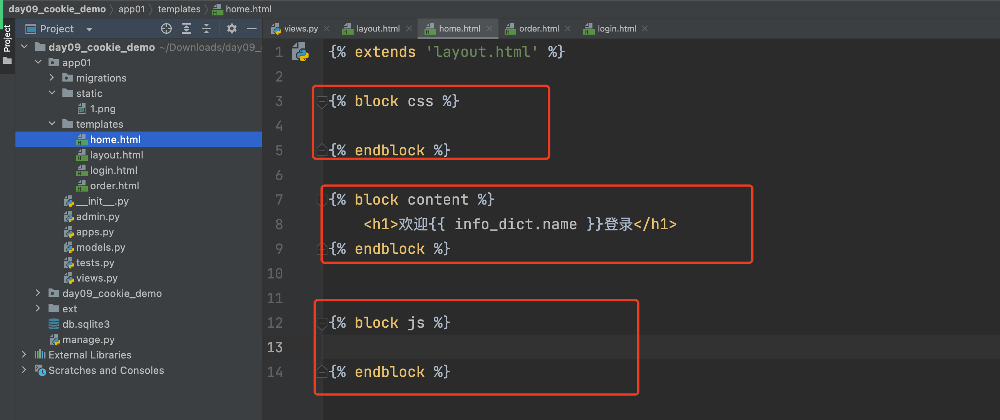

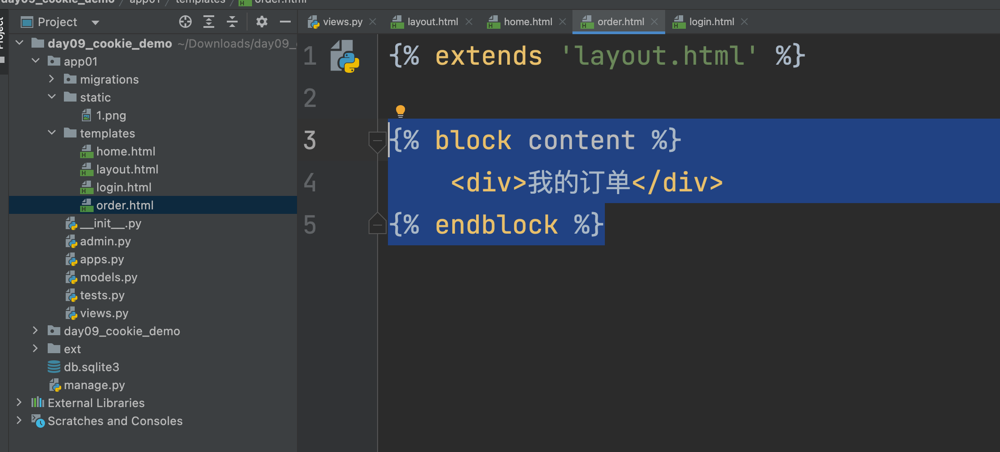


## 4.连表操作

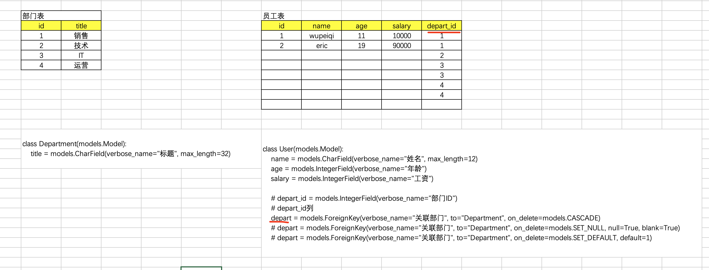

```python
class Department(models.Model):
    title = models.CharField(verbose_name="标题", max_length=32)

class User(models.Model):
    name = models.CharField(verbose_name="姓名", max_length=12)
    age = models.IntegerField(verbose_name="年龄")
    salary = models.IntegerField(verbose_name="工资")
    # depart_id 列
    depart = models.ForeignKey(verbose_name="关联部门", to="Department", on_delete=models.CASCADE)
```


新增：

```python
models.User.objects.create(name="武沛齐",age=11,salary=10000,depart_id=1)


depart_object = models.Department.objects.filter(id=1).first()
models.User.objects.create(name="武沛齐",age=11,salary=10000,depart=depart_object)
```


查询：

```python
# 构建条件
models.User.objects.filter(name='xx')
models.User.objects.filter(salary='xx')
models.User.objects.filter(depart_id=1)

models.User.objects.filter(depart__title="销售")
```

```python
# 获取数据
queryset = models.User.objects.all()
for row in queryset:
    row.id  row.name  row.age  row.salary  row.depart_id  row.depart.id  row.depart.title
```


## 案例

```python
class Department(models.Model):
    title = models.CharField(verbose_name="标题", max_length=32)


class User(models.Model):
    name = models.CharField(verbose_name="姓名", max_length=12)
    age = models.IntegerField(verbose_name="年龄")
    salary = models.IntegerField(verbose_name="工资")

    # depart_id = models.IntegerField(verbose_name="部门ID")
    # depart_id列
    depart = models.ForeignKey(verbose_name="关联部门", to="Department", on_delete=models.CASCADE)
    # depart = models.ForeignKey(verbose_name="关联部门", to="Department", on_delete=models.SET_NULL, null=True, blank=True)
    # depart = models.ForeignKey(verbose_name="关联部门", to="Department", on_delete=models.SET_DEFAULT, default=1)

```


## 5.Form和ModelForm


### 5.1 Form组件

django中的form组件有2大作用：

- 生成HTML表单标签
- 数据校验


快速上手

- 定义类

  ```python
  class MyForm(forms.Form):
      a1 = ...
      a2 = ...
  ```

- 视图函数

  ```python
  def xxx(request):
      if request.method == "GET":
          form = MyForm()
          return render(request,"xxx.html",{'form':form})
      
      # 用户提交的数据进行合法性校验
      form = MyForm(data=request.POST)
      if form.is_valid():
          print("成功",form.clearned_data) # {a1：123，a2：456}
      else:
          form.errors 获取所有的错误信息，
  ```

- 在HTML页面中

  ```html
  <form method="post">
      {{form.a1}}
      {{form.a2}}
      <input type='submit' value="提交" />
  </form>
  ```


#### 5.1.1 生成标签

```python
from django.shortcuts import render
from django import forms


class RoleForm(forms.Form):
    user = forms.CharField(
        label="用户名",
        widget=forms.TextInput(attrs={"class": "form-control"})
    )

    password = forms.CharField(
        label="密码",
        widget=forms.PasswordInput(attrs={"class": "form-control"})
    )
    email = forms.CharField(
        label="邮箱",
        widget=forms.EmailInput(attrs={"class": "form-control"}),
    )
    city = forms.ChoiceField(
        choices=[(1, "北京"), (2, "上海"), (3, "深圳"), ],
        widget=forms.Select(attrs={"class": "form-control"})
    )


def add_role(request):
    form = RoleForm()
    return render(request, 'add_role.html', {"form": form})
```

```html
<!DOCTYPE html>
<html lang="en">
<head>
    <meta charset="UTF-8">
    <title>Title</title>
</head>
<body>
<form>
    {{ form.user }}
    {{ form.password }}
    {{ form.email }}
    {{ form.city }}
    <input type="submit" value="提交"/>
</form>
</body>
</html>
```

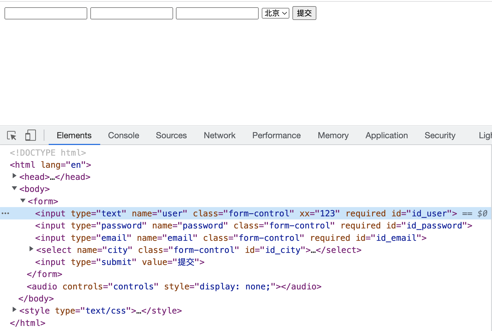


想要展示默认值：

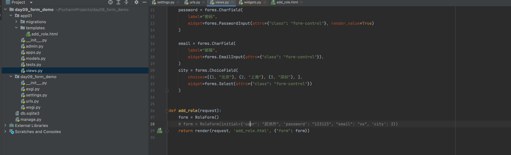


#### 5.1.2 初步校验

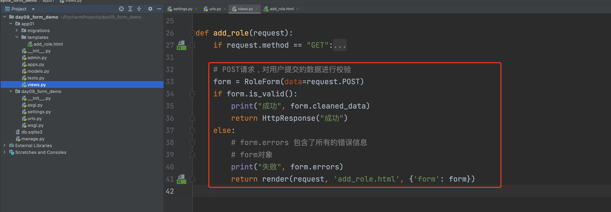

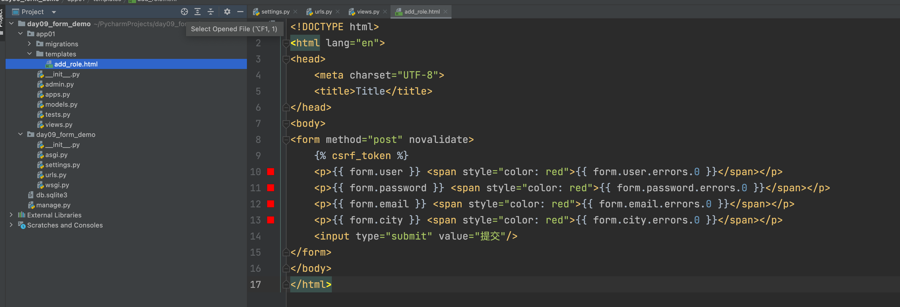

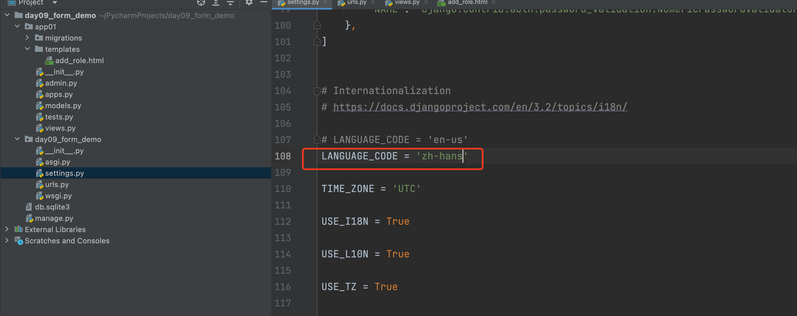


自定义校验，就可以写正则表达式实现：

```python
from django.shortcuts import render, HttpResponse
from django import forms
from django.core.validators import RegexValidator


class RoleForm(forms.Form):
    user = forms.CharField(
        label="用户名",
        widget=forms.TextInput(attrs={"class": "form-control"}),
        validators=[RegexValidator(r'^[0-9]+$', '请输入数字'), ]
    )

    password = forms.CharField(
        label="密码",
        widget=forms.PasswordInput(attrs={"class": "form-control"}, render_value=True)
    )

    email = forms.CharField(
        label="邮箱",
        required=False,
        widget=forms.EmailInput(attrs={"class": "form-control"}),
    )

    city = forms.ChoiceField(
        choices=[(1, "北京"), (2, "上海"), (3, "深圳"), ],
        widget=forms.Select(attrs={"class": "form-control"})
    )


def add_role(request):
    if request.method == "GET":
        form = RoleForm()
        # form = RoleForm(initial={'user': "武沛齐", 'password': "123123", "email": "xx", 'city': 3})
        return render(request, 'add_role.html', {"form": form})

    # POST请求，对用户提交的数据进行校验
    form = RoleForm(data=request.POST)
    if form.is_valid():
        print("成功", form.cleaned_data)
        return HttpResponse("成功")
    else:
        # form.errors 包含了所有的错误信息
        # form对象
        print("失败", form.errors)
        return render(request, 'add_role.html', {'form': form})
```


### 综合案例：登录

见案例：【day09_total_demo】


### 5.2 ModelForm

- models.py

  ```python
  from django.db import models
  
  
  class UserInfo(models.Model):
      """ 用户表 """
      username = models.CharField(verbose_name="用户名", max_length=32)
      password = models.CharField(verbose_name="密码", max_length=64)
      age = models.IntegerField(verbose_name="年龄")
  
  ```

- forms

  ```python
  class LoginModelForm(forms.ModelForm):
      class Meta:
          model = models.UserInfo
          # fields = ["username", "password", "age"]
          fields = "__all__"
          widgets = {
              "username":forms.TextInput(attrs={"class": "form-control"})
          }
  ```

- 默认显示数据 + 保存数据

  ```python
  obj = LoginModelForm(data=request.POST)
  obj.save()    # models.Userinfo.objects.create(....)
  ```

  ```python
  obj = models.UserInfo.objects.filter(id=1).first()
  
  obj = LoginModelForm(instance=obj)
  obj.save()    # models.Userinfo.objects.create(....)
  ```

  

### 综合案例：部门

见案例：【day09_total_demo】


知识的扩展：如果有如下的一张表

```python
class xxxx(models.Model):
    v1 = models.CharField(verbose_name="名称", max_length=32)
    v2 = models.IntegerField(verbose_name="人数")
    v3 = models.CharField(verbose_name="名称", max_length=32)
    v4 = models.IntegerField(verbose_name="人数")
    v5 = models.CharField(verbose_name="名称", max_length=32)
   	...
```

```python
class DepartModelForm(forms.ModelForm):
    class Meta:
        model = models.xxxx
        fields = "__all__"
```

```python
def add_user(request):
    form = DepartModelForm()
    return render(...., {"form":form})
```

```html
<form>
	{{form.v1.label}}:{{form.v1}}  <span>{{form.v1.errors.0}}</span>
	{{form.v2.label}}:{{form.v2}}  <span>{{form.v2.errors.0}}</span>
	{{form.v3.label}}:{{form.v3}}  <span>{{form.v3.errors.0}}</span>
	{{form.v4.label}}:{{form.v4}}  <span>{{form.v4.errors.0}}</span>
    ...
</form>

简便的形式
<form>
    
		{{field.label}}:{{field}}  <span>{{field.errors.0}}</span>
    
</form>
```


## 总结

- 单独知识是什么？
- 编写？


